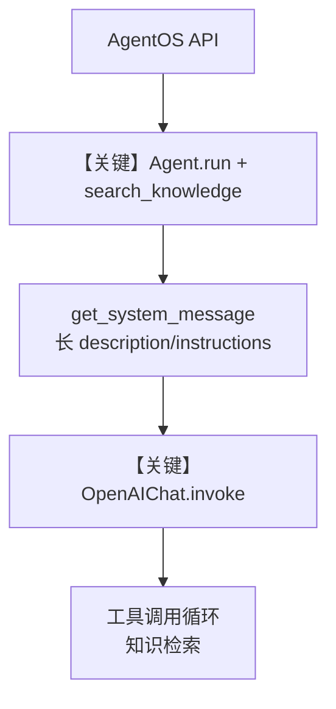

# 03_agent_with_knowledge_tracing.py — 实现原理分析

> 源文件：`cookbook/05_agent_os/tracing/03_agent_with_knowledge_tracing.py`

## 概述

本示例展示 Agno 的 **AgentOS + Knowledge（PgVector）+ tracing**：`AgnoAssist` Agent 绑定 `Knowledge`、`search_knowledge=True` 与双库（Postgres 向量 + Sqlite 会话），`AgentOS(tracing=True)` 将执行轨迹写入会话库侧可用的 tracing 管道。

**核心配置一览：**

| 配置项 | 值 | 说明 |
|--------|------|------|
| `db` | `PostgresDb(db_url, id="agno_assist_db")` | 向量/内容库元数据 |
| `db_sqlite` | `SqliteDb(db_file="tmp/traces.db")` | Agent `db`（会话等） |
| `knowledge` | `Knowledge(vector_db=PgVector(...), contents_db=db)` | 混合检索 + 内容库 |
| `agno_assist` | `Agent(...)` | 主 Agent，见下表显式参数 |
| `agent_os` | `AgentOS(agents=[agno_assist], tracing=True)` | 启用追踪 |
| `name` | `"Agno Assist"` | Agent 名称 |
| `id` | `"agno-assist"` | 稳定 ID |
| `model` | `OpenAIChat(id="gpt-4.1")` | Chat Completions |
| `description` | `description` 变量（dedent 长文） | 角色与目标 |
| `instructions` | `instructions` 变量（dedent 长文） | 任务步骤与工具策略 |
| `db` | `db_sqlite` | 会话/存储 |
| `update_memory_on_run` | `True` | 运行更新记忆 |
| `knowledge` | 同上 | RAG |
| `search_knowledge` | `True` | 启用 agentic 检索 |
| `add_history_to_context` | `True` | 历史注入 |
| `add_datetime_to_context` | `True` | 时间注入 system |
| `markdown` | `True` | Markdown 附加说明 |
| `tracing` | `True` | OS 级 tracing |

## 架构分层

```
用户代码层                agno.agent / agno.knowledge / agno.os
┌──────────────────┐    ┌──────────────────────────────────┐
│ AgentOS          │    │ _setup_tracing → Sqlite db       │
│ agents=[...]     │    │ Agent.run → get_run_messages      │
│                  │    │  search_knowledge 工具/检索循环    │
│ Knowledge        │    │ get_system_message L106+          │
│ PgVector+Postgres│    │ OpenAIChat.invoke                 │
└──────────────────┘    └──────────────────────────────────┘
                                │
                                ▼
                        ┌──────────────┐
                        │ gpt-4.1      │
                        └──────────────┘
```

## 核心组件解析

### Knowledge 与 `search_knowledge`

`Knowledge` 将 `PgVector` 与 `contents_db` 关联；`search_knowledge=True` 使 Agent 在运行时可调用知识检索相关能力（具体工具名由框架注册），与 `instructions` 中「Iterative Search」「search_knowledge_base」叙述一致。

### System 消息拼装

`get_system_message()`（`agno/agent/_messages.py` L106+）按 `# 3.3.1` 先写 `description`，再 `# 3.3.3` 写 instructions（可带 `<instructions>` 标签），并附加 datetime、markdown 等 `# 3.2` 段。

### AgentOS tracing

同 `02_basic_team_tracing.md`：`AgentOS(tracing=True)` → `_setup_tracing`（`agno/os/app.py` L616+）→ `setup_tracing_for_os`。

### 运行机制与因果链

1. **路径**：用户 → AgentOS API → `Agent.run` → 消息组装（system 含知识/记忆段若启用）→ `OpenAIChat.invoke`；知识加载在 `if __name__` 中 `knowledge.insert(...)` 执行一次。
2. **副作用**：Postgres 存内容与向量；Sqlite 存会话与 trace（取决于 tracing db 选择）；`update_memory_on_run` 可能写入记忆。
3. **分支**：若未安装 OpenTelemetry，`setup_tracing_for_os` 可能仅警告（见 `os/utils.py`）。
4. **定位**：相对纯 Agent tracing，本示例叠加 **生产型知识库（PgVector）+ 长 system 文案**。

## System Prompt 组装

| 序号 | 组成部分 | 本文件中的值/来源 | 是否生效 |
|------|---------|-----------------|---------|
| 1 | `description` | 变量 `description`（见下「还原」） | 是 |
| 2 | `instructions` | 变量 `instructions`（见下「还原」） | 是 |
| 3 | `markdown` | `True` | 是（`# 3.2.1`） |
| 4 | `add_datetime_to_context` | `True` | 是（`# 3.2.2`） |
| 5 | 记忆/知识等 | 视运行与配置 | 部分运行时 |

### 拼装顺序与源码锚点

默认路径：`# 3.3.1` description → `# 3.3.3` instructions（`use_instruction_tags` 默认下多为直接拼接）→ `# 3.3.4` `<additional_information>` 含 markdown 与时间（`agno/agent/_messages.py` L233–261）。

### 还原后的完整 System 文本

以下 **逐字** 来自源码中 `description`、`instructions`（dedent 后）；框架按 `# 3.3.1` 先追加 description，再 `# 3.3.3` 追加 instructions；其后还有 `<additional_information>`、工具与记忆等（需运行时验证）。

```text
You are AgnoAssist, an advanced AI Agent specialized in the Agno framework.
Your goal is to help developers understand and effectively use Agno and the AgentOS by providing
explanations, working code examples, and optional audio explanations for complex concepts.

Your mission is to provide comprehensive support for Agno developers. Follow these steps to ensure the best possible response:

1. **Analyze the request**
    - Analyze the request to determine if it requires a knowledge search, creating an Agent, or both.
    - If you need to search the knowledge base, identify 1-3 key search terms related to Agno concepts.
    - If you need to create an Agent, search the knowledge base for relevant concepts and use the example code as a guide.
    - When the user asks for an Agent, they mean an Agno Agent.
    - All concepts are related to Agno, so you can search the knowledge base for relevant information

After Analysis, always start the iterative search process. No need to wait for approval from the user.

2. **Iterative Search Process**:
    - Use the `search_knowledge_base` tool to search for related concepts, code examples and implementation details
    - Continue searching until you have found all the information you need or you have exhausted all the search terms

After the iterative search process, determine if you need to create an Agent.
If you do, ask the user if they want you to create an Agent for them.

3. **Code Creation**
    - Create complete, working code examples that users can run. For example:
    ```python
    from agno.agent import Agent
    from agno.tools.websearch import WebSearchTools

    agent = Agent(tools=[WebSearchTools()])

    # Perform a web search and capture the response
    response = agent.run("What's happening in France?")
    ```
    - You must remember to use agent.run() and NOT agent.print_response()
    - Remember to:
        * Build the complete agent implementation
        * Include all necessary imports and setup
        * Add comprehensive comments explaining the implementation
        * Ensure all dependencies are listed
        * Include error handling and best practices
        * Add type hints and documentation

4. **Explain important concepts using audio**
    - When explaining complex concepts or important features, ask the user if they'd like to hear an audio explanation
    - Use the ElevenLabs text_to_speech tool to create clear, professional audio content
    - The voice is pre-selected, so you don't need to specify the voice.
    - Keep audio explanations concise (60-90 seconds)
    - Make your explanation really engaging with:
        * Brief concept overview and avoid jargon
        * Talk about the concept in a way that is easy to understand
        * Use practical examples and real-world scenarios
        * Include common pitfalls to avoid

5. **Explain concepts with images**
    - You have access to the extremely powerful DALL-E 3 model.
    - Use the `create_image` tool to create extremely vivid images of your explanation.
    - Don't provide the URL of the image in the response. Only describe what image was generated.

Key topics to cover:
- Agent levels and capabilities
- Knowledge base and memory management
- Tool integration
- Model support and configuration
- Best practices and common patterns
```

（续：`get_system_message` 会在其后追加 markdown 与时间等，见 `_messages.py` `# 3.2`。）

### 段落释义（模型视角）

- **description**：定义 AgnoAssist 身份与交付物类型。
- **instructions**：强制「先分析→再迭代检索→再决定是否建 Agent→代码/音频/图像」流水线。
- **附加段**：Markdown 与时间帮助输出格式与时效性。

### 与 User 消息边界

用户请求进入 `user` role；知识检索结果以工具结果或上下文形式进入后续轮次。

## 完整 API 请求

```python
# agno/models/openai/chat.py OpenAIChat.invoke 约 L412+
client.chat.completions.create(
    model="gpt-4.1",
    messages=[
        {"role": "system", "content": "<上一节还原 + 附加 + 工具说明>"},
        # 若 add_history_to_context：中间插入历史
        {"role": "user", "content": "<当前用户问题>"},
    ],
    tools=[...],  # 含 search_knowledge 等
)
```

## Mermaid 流程图



## 关键源码文件索引

| 文件 | 关键函数/类 | 作用 |
|------|------------|------|
| `agno/agent/_messages.py` | `get_system_message()` L106+ | System 拼装 |
| `agno/os/app.py` | `_setup_tracing()` L616+ | OS tracing |
| `agno/knowledge/knowledge.py` | `Knowledge` | RAG 入口 |
| `agno/models/openai/chat.py` | `invoke()` L385+ | Chat Completions |
