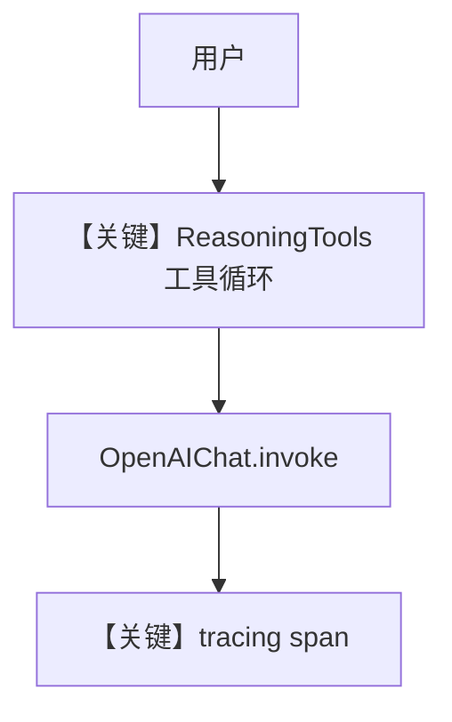

# 04_agent_with_reasoning_tools_tracing.py — 实现原理分析

> 源文件：`cookbook/05_agent_os/tracing/04_agent_with_reasoning_tools_tracing.py`

## 概述

本示例展示 Agno 的 **ReasoningTools + AgentOS tracing**：`ReasoningTools(add_instructions=True)` 会向模型侧注入推理类工具及说明；`stream_events=True` 打开事件流；`AgentOS(tracing=True)` 记录执行轨迹。

**核心配置一览：**

| 配置项 | 值 | 说明 |
|--------|------|------|
| `db_sqlite` | `SqliteDb(db_file="tmp/traces.db")` | 会话与 tracing 候选库 |
| `model` | `OpenAIChat(id="gpt-4o")` | Chat Completions |
| `tools` | `[ReasoningTools(add_instructions=True)]` | 推理工具 + 工具说明注入 |
| `instructions` | `dedent("""...""")` | 长文问题解决流程 |
| `add_datetime_to_context` | `True` | 时间进 system |
| `stream_events` | `True` | 流式事件 |
| `markdown` | `True` | Markdown 附加段 |
| `db` | `db_sqlite` | 持久化 |
| `agent_os` | `AgentOS(agents=[...], tracing=True)` | OS 级 tracing |
| `description` | 未设置 | 未设置 |
| `name` | 未设置 | 未设置 |

## 架构分层

```
用户代码层                agno.agent / agno.tools.reasoning
┌──────────────────┐    ┌──────────────────────────────────┐
│ reasoning_agent│    │ get_system_message L106+          │
│ ReasoningTools │    │ _tool_instructions（工具说明）     │
│                │───>│ Agent._run → invoke L385+        │
└──────────────────┘    └──────────────────────────────────┘
```

## 核心组件解析

### ReasoningTools

`add_instructions=True` 时，工具模块可向 Agent 注册额外指令，最终进入 `agent._tool_instructions` 并在 `get_system_message` 的 `# 3.3.5` 段拼入（`agno/agent/_messages.py` 约 L262–265）。

### 运行机制与因果链

1. **路径**：用户输入 → `get_run_messages` → `OpenAIChat.invoke` → 可能多轮工具（推理）调用。
2. **副作用**：Sqlite 写会话；tracing 写 span。
3. **分支**：无 `description` 时 `# 3.3.1` 跳过；`build_context` 默认真则拼装 system。
4. **定位**：强调 **推理工具 + 流式事件 + tracing** 三件套。

## System Prompt 组装

| 序号 | 组成部分 | 本文件 | 是否生效 |
|------|---------|--------|---------|
| 1 | `description` | 无 | 否 |
| 2 | `instructions` | dedent 长文 | 是 |
| 3 | `markdown` | True | 是 |
| 4 | `add_datetime_to_context` | True | 是 |
| 5 | 工具说明 | ReasoningTools 注入 | 是 |

### 拼装顺序与源码锚点

`# 3.1` instructions → `# 3.2` 附加信息 → `# 3.3.3` 写入正文 → `# 3.3.5` 工具指令（`agno/agent/_messages.py`）。

### 还原后的完整 System 文本

```text
You are an expert problem-solving assistant with strong analytical skills! 

Your approach to problems:
1. First, break down complex questions into component parts
2. Clearly state your assumptions
3. Develop a structured reasoning path
4. Consider multiple perspectives
5. Evaluate evidence and counter-arguments
6. Draw well-justified conclusions

When solving problems:
- Use explicit step-by-step reasoning
- Identify key variables and constraints
- Explore alternative scenarios
- Highlight areas of uncertainty
- Explain your thought process clearly
- Consider both short and long-term implications
- Evaluate trade-offs explicitly

For quantitative problems:
- Show your calculations
- Explain the significance of numbers
- Consider confidence intervals when appropriate
- Identify source data reliability

For qualitative reasoning:
- Assess how different factors interact
- Consider psychological and social dynamics
- Evaluate practical constraints
- Address value considerations

```

（随后为 `<additional_information>` 中的 markdown 与当前时间，以及 `# 3.3.5` 的 ReasoningTools 说明文本，需运行时确认。）

### 段落释义

- **instructions**：强制结构化推理与定量/定性区分。
- **工具段**：让模型知晓可调用的推理工具及用法。

## 完整 API 请求

```python
# agno/models/openai/chat.py L412+
client.chat.completions.create(
    model="gpt-4o",
    messages=[
        {"role": "system", "content": "<上节+工具模式>"},
        {"role": "user", "content": "<用户问题>"},
    ],
    tools=[...],  # ReasoningTools 序列化
    stream=True,  # 若 run 使用流式
)
```

## Mermaid 流程图



## 关键源码文件索引

| 文件 | 关键函数/类 | 作用 |
|------|------------|------|
| `agno/agent/_messages.py` | `get_system_message()` L106+ | System 与工具段 |
| `agno/os/app.py` | `_setup_tracing()` L616+ | tracing |
| `agno/models/openai/chat.py` | `invoke()` L385+ | API 调用 |
