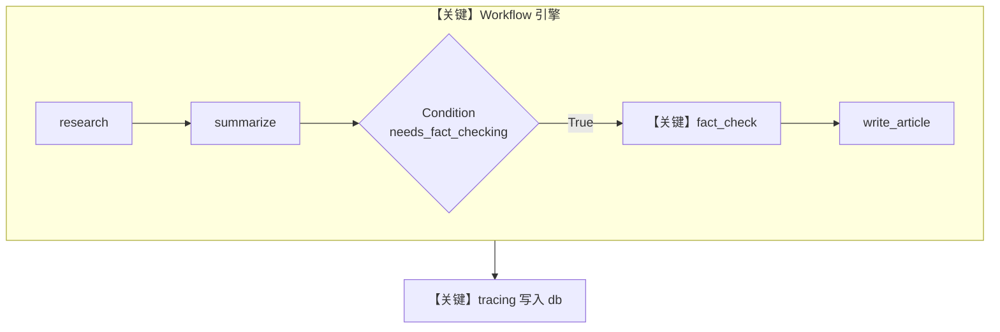

# 05_basic_workflow_tracing.py — 实现原理分析

<!-- cookbook-py-source:start -->
## 完整源码

```python
"""
Traces with AgentOS
Requirements:
    uv pip install agno opentelemetry-api opentelemetry-sdk openinference-instrumentation-agno
"""

from agno.agent import Agent
from agno.db.sqlite import SqliteDb
from agno.os import AgentOS
from agno.tools.websearch import WebSearchTools
from agno.workflow.condition import Condition
from agno.workflow.step import Step
from agno.workflow.types import StepInput
from agno.workflow.workflow import Workflow

# ---------------------------------------------------------------------------
# Create Example
# ---------------------------------------------------------------------------

# Set up database
db = SqliteDb(db_file="tmp/traces.db")

# === BASIC AGENTS ===
researcher = Agent(
    name="Researcher",
    instructions="Research the given topic and provide detailed findings.",
    tools=[WebSearchTools()],
)

summarizer = Agent(
    name="Summarizer",
    instructions="Create a clear summary of the research findings.",
)

fact_checker = Agent(
    name="Fact Checker",
    instructions="Verify facts and check for accuracy in the research.",
    tools=[WebSearchTools()],
)

writer = Agent(
    name="Writer",
    instructions="Write a comprehensive article based on all available research and verification.",
)

# === CONDITION EVALUATOR ===


def needs_fact_checking(step_input: StepInput) -> bool:
    """Determine if the research contains claims that need fact-checking"""
    return True


# === WORKFLOW STEPS ===
research_step = Step(
    name="research",
    description="Research the topic",
    agent=researcher,
)

summarize_step = Step(
    name="summarize",
    description="Summarize research findings",
    agent=summarizer,
)

# Conditional fact-checking step
fact_check_step = Step(
    name="fact_check",
    description="Verify facts and claims",
    agent=fact_checker,
)

write_article = Step(
    name="write_article",
    description="Write final article",
    agent=writer,
)

# === BASIC LINEAR WORKFLOW ===
basic_workflow = Workflow(
    name="Basic Linear Workflow",
    description="Research -> Summarize -> Condition(Fact Check) -> Write Article",
    db=db,
    steps=[
        research_step,
        summarize_step,
        Condition(
            name="fact_check_condition",
            description="Check if fact-checking is needed",
            evaluator=needs_fact_checking,
            steps=[fact_check_step],
        ),
        write_article,
    ],
)

# Setup our AgentOS app
agent_os = AgentOS(
    description="Example app for tracing Basic Workflow",
    workflows=[basic_workflow],
    tracing=True,
)
app = agent_os.get_app()

# ---------------------------------------------------------------------------
# Run Example
# ---------------------------------------------------------------------------

if __name__ == "__main__":
    agent_os.serve(app="05_basic_workflow_tracing:app", reload=True)
```

<!-- cookbook-py-source:end -->

> 源文件：`cookbook/05_agent_os/tracing/05_basic_workflow_tracing.py`

## 概述

本示例展示 Agno 的 **Workflow + Condition 分支 + AgentOS tracing**：线性步骤中插入条件子工作流（事实核查），各 `Step` 绑定 `Agent`；`AgentOS(workflows=[...], tracing=True)` 为工作流与各 Agent 调用生成追踪。

**核心配置一览：**

| 配置项 | 值 | 说明 |
|--------|------|------|
| `db` | `SqliteDb(db_file="tmp/traces.db")` | Workflow 与会话/trace |
| `researcher` 等 | `Agent(...)` | 多 Agent，多数 **未显式设置 model** |
| `researcher.tools` | `[WebSearchTools()]` | 检索 |
| `basic_workflow` | `Workflow(steps=[..., Condition(...), ...])` | 条件分支 |
| `Condition` | `evaluator=needs_fact_checking` | 恒为 True（示例） |
| `agent_os` | `AgentOS(workflows=[basic_workflow], tracing=True)` | 仅注册工作流 |
| `description` | `"Example app for tracing Basic Workflow"` | OS 描述 |

## 架构分层

本示例 **不以单一 Agent 为入口**，提示词分布在 **各 Step 的 Agent** 与 **Workflow/Step 元数据** 中；执行时由 `Workflow` 引擎逐步调用子 Agent 的 `get_system_message()`（`agno/agent/_messages.py` L106+）。

```
用户代码层                agno.workflow / agno.agent
┌──────────────────┐    ┌──────────────────────────────────┐
│ Workflow steps   │    │ Step.run → Agent.run              │
│ Condition        │───>│ get_system_message per agent      │
│                  │    │ OpenAIChat.invoke（若已配置 model）│
└──────────────────┘    └──────────────────────────────────┘
```

## 核心组件解析

### Workflow 与 Condition

`Condition`（`agno/workflow/condition.py`）在运行时根据 `evaluator(step_input)` 决定是否执行嵌套 `steps`；本例 `needs_fact_checking` 恒返回 `True`，故事实核查步总会跑。

### Agent 模型

源码中 `researcher` 等 **未传 `model`**。运行前须保证框架或环境为 Agent 提供默认模型，否则在需要 LLM 的步骤可能在 `get_system_message` 处因 `model is None` 报错（`agno/agent/_messages.py` 约 L158–159）。生产代码应为每个 Agent 显式设置 `model`。

### 运行机制与因果链

1. **路径**：AgentOS 触发工作流 → 逐步执行 `Step` → 每步 Agent `run` → LLM/工具。
2. **副作用**：`db` 持久化工作流会话；`tracing=True` 写 OT span。
3. **分支**：`Condition` 为 False 时跳过 `fact_check_step`。
4. **定位**：演示 **工作流拓扑 + tracing**，非单 Agent prompt 技巧。

## System Prompt 组装

不存在「单一 AgentOS 级 system」覆盖整个工作流。下表为 **Researcher Agent**（第一步）在默认拼装下的主要字段：

| 序号 | 组成部分 | 本文件 | 是否生效 |
|------|---------|--------|---------|
| 1 | `instructions` | `"Research the given topic..."` | 是 |
| 2 | `tools` | WebSearchTools | 是（工具 schema 进请求） |
| 3 | `description` / `role` | 未设置 | 否 |

### 还原后的完整 System 文本（Researcher，静态部分）

```text
Research the given topic and provide detailed findings.
```

（另含 `# 3.2.1` markdown 若 `markdown` 默认真、`# 3.3.5` 工具说明等，依 Agent 默认属性而定；请在运行时打印 `get_system_message` 验证。）

### 与 User 消息边界

每步的 `user` 内容来自工作流传入的 `StepInput` 及前序输出拼接（由 Workflow 引擎构造）。

## 完整 API 请求

每步等价于该步 Agent 的一次 `chat.completions.create`（当 `model` 为 `OpenAIChat` 且已设置）：

```python
client.chat.completions.create(
    model="<须为 Agent 配置的 model id>",
    messages=[
        {"role": "system", "content": "<该步 Agent 的 get_system_message>"},
        {"role": "user", "content": "<Step 输入>"},
    ],
    tools=[...],  # WebSearchTools 等
)
```

## Mermaid 流程图



## 关键源码文件索引

| 文件 | 关键函数/类 | 作用 |
|------|------------|------|
| `agno/workflow/workflow.py` | `Workflow` | 步骤编排 |
| `agno/workflow/condition.py` | `Condition` | 条件分支 |
| `agno/agent/_messages.py` | `get_system_message()` L106+ | 各 Agent system |
| `agno/os/app.py` | `_setup_tracing()` L616+ | tracing |
