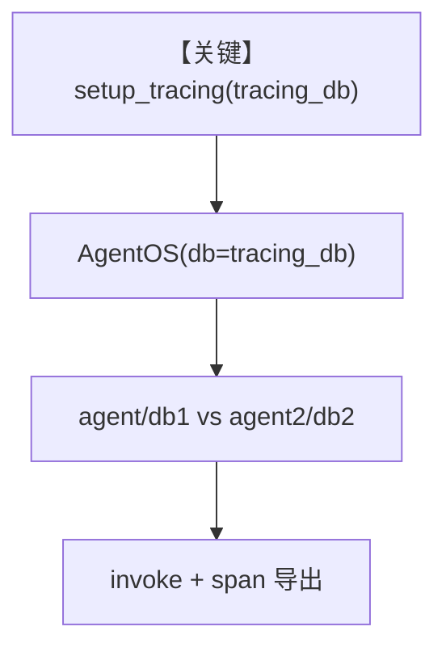

# 06_tracing_with_multi_db_scenario.py — 实现原理分析

> 源文件：`cookbook/05_agent_os/tracing/06_tracing_with_multi_db_scenario.py`

## 概述

本示例展示 Agno 的 **多库隔离 + 显式 `setup_tracing`**：两个 Agent 各自使用 `db1`、`db2`；在 OS 之外先调用 `setup_tracing(db=tracing_db, batch_processing=True, ...)` 配置全局 OT 导出；`AgentOS(db=tracing_db)` 将会话/追踪默认库指向专用 `tracing_db`。

**核心配置一览：**

| 配置项 | 值 | 说明 |
|--------|------|------|
| `db1` | `SqliteDb(..., id="db1")` | Agent1 数据 |
| `db2` | `SqliteDb(..., id="db2")` | Agent2 数据 |
| `tracing_db` | `SqliteDb(..., id="traces")` | 追踪与 OS 默认库 |
| `setup_tracing` | `batch_processing=True` 等 | 批处理导出参数 |
| `agent` / `agent2` | 见源码 | 两 Agent 不同指令与工具 |
| `agent_os` | `AgentOS(agents=[...], db=tracing_db)` | **未**传 `tracing=True`（依赖预置 setup_tracing） |
| `tracing` | 未在 AgentOS 显式设置 | 未设置 |

## 架构分层

```
用户代码层                agno.tracing / agno.os
┌──────────────────┐    ┌──────────────────────────────────┐
│ setup_tracing    │───>│ TracerProvider + DB exporter      │
│ AgentOS db=      │    │ 各 Agent.run → span               │
│ tracing_db       │    │ get_system_message → invoke       │
└──────────────────┘    └──────────────────────────────────┘
```

## 核心组件解析

### setup_tracing

`setup_tracing()`（`agno/tracing/setup.py` 约 L23+）在 OpenTelemetry 可用时注册 `TracerProvider`；若已存在 provider 则跳过（约 L71–75），避免热重载重复初始化。

### 多库语义

业务数据与 trace 库分离：`agent.db` 与 `agent2.db` 指向不同文件；`AgentOS.db` 指向 `tracing_db`，便于 **只读追踪** 与 **Agent 会话** 使用同一 trace 库（注释所述）。

### 运行机制与因果链

1. **路径**：进程启动 → `setup_tracing` → `agent_os.serve` → 请求命中某一 Agent → LLM。
2. **副作用**：三文件 Sqlite；批处理导出参数影响延迟与吞吐。
3. **分支**：与 `07` 对照——本例 **手动** `setup_tracing`，OS 构造函数 **不传** `tracing=True`。
4. **定位**：多租户/多库场景下 **trace 落库与业务库分离**。

## System Prompt 组装

### Agent「HackerNews Agent」

| 组成部分 | 值 | 生效 |
|---------|-----|------|
| `instructions` | `"You are a hacker news agent..."` | 是 |
| `markdown` | `True` | 是 |

### Agent「Web Search Agent」

| 组成部分 | 值 | 生效 |
|---------|-----|------|
| `instructions` | `"You are a web search agent..."` | 是 |
| `markdown` | `True` | 是 |

### 还原后的完整 System 文本（HackerNews Agent）

```text
You are a hacker news agent. Answer questions concisely.

<additional_information>
- Use markdown to format your answers.
</additional_information>
```

（时间等若未启用 `add_datetime_to_context` 则无。）

## 完整 API 请求

```python
client.chat.completions.create(
    model="gpt-4o-mini",
    messages=[
        {"role": "system", "content": "<上节或 Web Search 对应 system>"},
        {"role": "user", "content": "<用户输入>"},
    ],
    tools=[...],
)
```

## Mermaid 流程图



## 关键源码文件索引

| 文件 | 关键函数/类 | 作用 |
|------|------------|------|
| `agno/tracing/setup.py` | `setup_tracing()` L23+ | OT 初始化 |
| `agno/agent/_messages.py` | `get_system_message()` L106+ | System |
| `agno/models/openai/chat.py` | `invoke()` L385+ | API |
