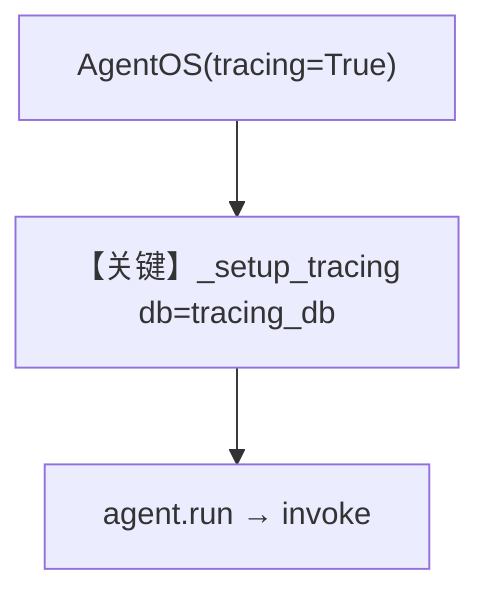

# 07_tracing_with_multi_db_and_tracing_flag.py — 实现原理分析

<!-- cookbook-py-source:start -->
## 完整源码

```python
"""
Traces with AgentOS
Requirements:
    pip install agno opentelemetry-api opentelemetry-sdk openinference-instrumentation-agno
"""

from agno.agent import Agent
from agno.db.sqlite import SqliteDb
from agno.models.openai import OpenAIChat
from agno.os import AgentOS
from agno.tools.hackernews import HackerNewsTools
from agno.tools.websearch import WebSearchTools

# ---------------------------------------------------------------------------
# Create Example
# ---------------------------------------------------------------------------

# Set up databases - each agent has its own db
db1 = SqliteDb(db_file="tmp/db1.db", id="db1")
db2 = SqliteDb(db_file="tmp/db2.db", id="db2")

# Dedicated traces database
tracing_db = SqliteDb(db_file="tmp/traces.db", id="traces")

agent = Agent(
    name="HackerNews Agent",
    model=OpenAIChat(id="gpt-4o-mini"),
    tools=[HackerNewsTools()],
    instructions="You are a hacker news agent. Answer questions concisely.",
    markdown=True,
    db=db1,
)

agent2 = Agent(
    name="Web Search Agent",
    model=OpenAIChat(id="gpt-4o-mini"),
    tools=[WebSearchTools()],
    instructions="You are a web search agent. Answer questions concisely.",
    markdown=True,
    db=db2,
)

# Setup our AgentOS app with dedicated db
# This ensures traces are written to and read from the same database
agent_os = AgentOS(
    description="Example app for tracing HackerNews",
    agents=[agent, agent2],
    tracing=True,
    db=tracing_db,  # Default database for the AgentOS (used for tracing)
)
app = agent_os.get_app()

# ---------------------------------------------------------------------------
# Run Example
# ---------------------------------------------------------------------------

if __name__ == "__main__":
    agent_os.serve(app="07_tracing_with_multi_db_and_tracing_flag:app", reload=True)
```

<!-- cookbook-py-source:end -->

> 源文件：`cookbook/05_agent_os/tracing/07_tracing_with_multi_db_and_tracing_flag.py`

## 概述

本示例展示 Agno 的 **多库 + `AgentOS(tracing=True)`**：与 `06` 类似，两 Agent 使用独立 `db1`/`db2`，但 **不**手动调用 `setup_tracing`，而是通过 **`tracing=True` + `AgentOS(db=tracing_db)`** 让 `_setup_tracing` 选用 OS 传入的专用库作为 trace 落点。

**核心配置一览：**

| 配置项 | 值 | 说明 |
|--------|------|------|
| `db1` / `db2` | `SqliteDb` 带 id | 业务会话分离 |
| `tracing_db` | `SqliteDb(..., id="traces")` | OS 默认库 = trace |
| `agent_os` | `tracing=True`, `db=tracing_db` | 自动 setup_tracing_for_os |
| `tracing` | `True` | 显式开启 |

## 架构分层

与 `06` 相同的数据流；差别仅在 **tracing 初始化路径**：`AgentOS.__init__` 末尾 `if self.tracing: self._setup_tracing()`（`agno/os/app.py` 约 L334–335），且 `_setup_tracing` 优先 `self.db`（L622–624）。

## 核心组件解析

### 与 06 的对照

| 场景 | 06 | 07 |
|------|----|----|
| `setup_tracing(...)` 手动调用 | 是 | 否 |
| `AgentOS(tracing=...)` | 未传 | `True` |

### 运行机制与因果链

1. **路径**：`tracing=True` → `_setup_tracing` → `setup_tracing_for_os(db=tracing_db)`（`agno/os/utils.py` L989+）。
2. **副作用**：span 进 `tracing_db`；两 Agent 业务状态仍在各自文件。
3. **分支**：若忘传 `db` 且无 agent.db，会警告（`app.py` L647+）——本例已传 `db=tracing_db`，无此问题。

## System Prompt 组装

同 `06_tracing_with_multi_db_scenario.md` 两 Agent 的 instructions + markdown 组合；还原文本略（见该文档「还原」小节同类结构）。

### 还原后的完整 System 文本（HackerNews Agent）

```text
You are a hacker news agent. Answer questions concisely.

<additional_information>
- Use markdown to format your answers.
</additional_information>
```

## 完整 API 请求

同 `06`，`model=gpt-4o-mini`，`chat.completions.create`（`chat.py` L412+）。

## Mermaid 流程图



## 关键源码文件索引

| 文件 | 关键函数/类 | 作用 |
|------|------------|------|
| `agno/os/app.py` | `_setup_tracing()` L616–654 | 选库并启用 tracing |
| `agno/os/utils.py` | `setup_tracing_for_os()` L989+ | 导出器 |
| `agno/agent/_messages.py` | `get_system_message()` L106+ | System |
