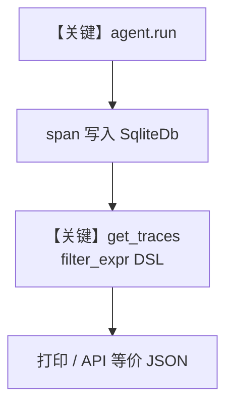

# 08_advanced_trace_filtering.py — 实现原理分析

<!-- cookbook-py-source:start -->
## 完整源码

```python
"""
Advanced Trace Filtering
========================

Demonstrates the FilterExpr DSL for composable trace queries.

This cookbook shows how to:
1. Run agents with tracing enabled
2. Use the FilterExpr DSL to build complex search queries
3. Convert filters to SQLAlchemy WHERE clauses
4. Query traces with advanced filters (AND/OR/NOT, CONTAINS, range queries)

The FilterExpr DSL supports:
- Comparison: EQ, NEQ, GT, GTE, LT, LTE
- Inclusion: IN
- String matching: CONTAINS (case-insensitive), STARTSWITH (prefix)
- Logical: AND, OR, NOT

Requirements:
    uv pip install agno opentelemetry-api opentelemetry-sdk openinference-instrumentation-agno
"""

from agno.agent import Agent
from agno.db.sqlite import SqliteDb
from agno.filters import AND, CONTAINS, EQ, GT, GTE, IN, LTE, NEQ, NOT, OR, STARTSWITH
from agno.models.openai import OpenAIChat
from agno.tools.hackernews import HackerNewsTools
from agno.tools.yfinance import YFinanceTools
from agno.tracing import setup_tracing

# ---------------------------------------------------------------------------
# Setup
# ---------------------------------------------------------------------------

db = SqliteDb(db_file="tmp/advanced_filtering.db")
setup_tracing(db=db)

# ---------------------------------------------------------------------------
# Create Agents
# ---------------------------------------------------------------------------

news_agent = Agent(
    name="HackerNews Agent",
    id="hackernews-agent",
    model=OpenAIChat(id="gpt-5.2"),
    tools=[HackerNewsTools()],
    instructions="You are a hacker news agent. Answer questions concisely.",
    markdown=True,
    user_id="admin_user",
    session_id="session-news",
)

stock_agent = Agent(
    name="Stock Agent",
    id="stock-agent",
    model=OpenAIChat(id="gpt-5.2"),
    tools=[YFinanceTools(enable_stock_price=True)],
    instructions="You are a stock analyst. Answer questions concisely.",
    markdown=True,
    user_id="trader_user",
    session_id="session-stocks",
)


# ---------------------------------------------------------------------------
# Run Example
# ---------------------------------------------------------------------------


def run_advanced_filtering_demo() -> None:
    # Step 1: Generate traces from both agents
    print("=" * 60)
    print("Step 1: Running agents to generate traces...")
    print("=" * 60)

    news_agent.run("What are the top 2 stories on Hacker News?")
    print("  [OK] HackerNews agent ran successfully")

    stock_agent.run("What is the current price of AAPL?")
    print("  [OK] Stock agent ran successfully")

    # Step 2: Demonstrate FilterExpr DSL
    print("\n" + "=" * 60)
    print("Step 2: Building filter expressions with the FilterExpr DSL")
    print("=" * 60)

    # Simple equality filter
    f1 = EQ("status", "OK")
    print(f"\n  EQ filter:          {f1.to_dict()}")

    # Not-equal filter
    f2 = NEQ("status", "ERROR")
    print(f"  NEQ filter:         {f2.to_dict()}")

    # String matching filters
    f3 = CONTAINS("user_id", "admin")
    print(f"  CONTAINS filter:    {f3.to_dict()}")

    f4 = STARTSWITH("name", "Stock")
    print(f"  STARTSWITH filter:  {f4.to_dict()}")

    # Range query with GTE/LTE
    f5 = AND(GTE("duration_ms", 100), LTE("duration_ms", 10000))
    print(f"  Range filter:       {f5.to_dict()}")

    # IN filter for multiple values
    f6 = IN("agent_id", ["hackernews-agent", "stock-agent"])
    print(f"  IN filter:          {f6.to_dict()}")

    # Complex composable query
    complex_filter = AND(
        EQ("status", "OK"),
        CONTAINS("user_id", "user"),
        OR(
            EQ("agent_id", "hackernews-agent"),
            EQ("agent_id", "stock-agent"),
        ),
    )
    print("\n  Complex filter (AND + OR):")
    import json

    print(f"  {json.dumps(complex_filter.to_dict(), indent=4)}")

    # Negation
    exclude_filter = AND(
        NEQ("status", "ERROR"),
        NOT(IN("agent_id", ["test-agent"])),
    )
    print("\n  Exclude filter (NEQ + NOT):")
    print(f"  {json.dumps(exclude_filter.to_dict(), indent=4)}")

    # Operator overloading (Pythonic syntax)
    pythonic_filter = (EQ("status", "OK") & GT("duration_ms", 0)) | EQ(
        "agent_id", "stock-agent"
    )
    print("\n  Pythonic filter (& | ~):")
    print(f"  {json.dumps(pythonic_filter.to_dict(), indent=4)}")

    # Step 3: Query traces using filters
    print("\n" + "=" * 60)
    print("Step 3: Querying traces with filter_expr")
    print("=" * 60)

    # Query: All OK traces
    print("\n  Query 1: All traces with status = OK")
    traces, count = db.get_traces(filter_expr=EQ("status", "OK").to_dict())
    print(f"  Found {count} traces")
    for t in traces:
        print(
            f"    - {t.name} | status={t.status} | {t.duration_ms}ms | agent={t.agent_id}"
        )

    # Query: Traces from a specific agent
    print("\n  Query 2: Traces from hackernews-agent")
    traces, count = db.get_traces(
        filter_expr=EQ("agent_id", "hackernews-agent").to_dict()
    )
    print(f"  Found {count} traces")
    for t in traces:
        print(f"    - {t.name} | agent={t.agent_id} | user={t.user_id}")

    # Query: Traces with user_id containing 'admin'
    print("\n  Query 3: Traces where user_id contains 'admin'")
    traces, count = db.get_traces(filter_expr=CONTAINS("user_id", "admin").to_dict())
    print(f"  Found {count} traces")
    for t in traces:
        print(f"    - {t.name} | user={t.user_id}")

    # Query: Traces with agent_id starting with 'stock'
    print("\n  Query 4: Traces where agent_id starts with 'stock'")
    traces, count = db.get_traces(filter_expr=STARTSWITH("agent_id", "stock").to_dict())
    print(f"  Found {count} traces")
    for t in traces:
        print(f"    - {t.name} | agent={t.agent_id}")

    # Query: Complex filter - status OK AND (hackernews OR stock agent)
    print("\n  Query 5: Complex - status=OK AND (hackernews OR stock agent)")
    complex = AND(
        EQ("status", "OK"),
        IN("agent_id", ["hackernews-agent", "stock-agent"]),
    )
    traces, count = db.get_traces(filter_expr=complex.to_dict())
    print(f"  Found {count} traces")
    for t in traces:
        print(f"    - {t.name} | status={t.status} | agent={t.agent_id}")

    # Query: Duration range query
    print("\n  Query 6: Traces with duration between 0ms and 60000ms")
    range_filter = AND(GTE("duration_ms", 0), LTE("duration_ms", 60000))
    traces, count = db.get_traces(filter_expr=range_filter.to_dict())
    print(f"  Found {count} traces")
    for t in traces:
        print(f"    - {t.name} | {t.duration_ms}ms")

    # Query: Exclude specific agents
    print("\n  Query 7: All traces NOT from 'stock-agent'")
    exclude = NEQ("agent_id", "stock-agent")
    traces, count = db.get_traces(filter_expr=exclude.to_dict())
    print(f"  Found {count} traces")
    for t in traces:
        print(f"    - {t.name} | agent={t.agent_id}")

    # Step 4: Show the JSON structure for API usage
    print("\n" + "=" * 60)
    print("Step 4: JSON body for POST /traces/search API")
    print("=" * 60)

    api_filter = AND(
        EQ("status", "OK"),
        CONTAINS("user_id", "admin"),
    )
    api_body = {
        "filter": api_filter.to_dict(),
        "page": 1,
        "limit": 20,
    }
    print("\n  Request body for POST /traces/search:")
    print(f"  {json.dumps(api_body, indent=4)}")

    print("\n" + "=" * 60)
    print("Done!")
    print("=" * 60)


if __name__ == "__main__":
    run_advanced_filtering_demo()
```

<!-- cookbook-py-source:end -->

> 源文件：`cookbook/05_agent_os/tracing/08_advanced_trace_filtering.py`

## 概述

本示例展示 Agno 的 **FilterExpr DSL + `db.get_traces`**：先用两 Agent `run` 产生 trace，再用 `EQ`/`AND`/`CONTAINS` 等算子构造 `filter_expr`，调用 `SqliteDb.get_traces` 做服务端过滤；**非 AgentOS 入口**，核心在 **查询层**。

**核心配置一览：**

| 配置项 | 值 | 说明 |
|--------|------|------|
| `db` | `SqliteDb(db_file="tmp/advanced_filtering.db")` | 存储与查询 |
| `setup_tracing` | `setup_tracing(db=db)` | 手动启用追踪 |
| `news_agent` | `OpenAIChat(gpt-5.2)`, HackerNews | 生成 trace |
| `stock_agent` | `OpenAIChat(gpt-5.2)`, YFinance | 生成 trace |
| `user_id` / `session_id` | 各 Agent 显式设置 | 用于过滤演示 |
| `AgentOS` | 无 | 未使用 |

## 架构分层

```
用户代码层                agno.db / agno.filters
┌──────────────────┐    ┌──────────────────────────────────┐
│ agent.run        │───>│ span 写入 db                      │
│ FilterExpr       │    │ db.get_traces(filter_expr=...)    │
└──────────────────┘    └──────────────────────────────────┘
```

## 核心组件解析

### FilterExpr

`agno.filters` 提供 `EQ`、`AND`、`CONTAINS` 等，可 `to_dict()` 序列化；`db.get_traces` 接收字典化过滤器（本例 `EQ("status","OK").to_dict()` 等）。

### 运行机制与因果链

1. **路径**：`setup_tracing` → `agent.run`（产生数据）→ `get_traces` 读回。
2. **副作用**：仅本地 Sqlite；无 AgentOS。
3. **分支**：不同 filter 影响结果集规模。
4. **定位**：**高级查询与 DSL**，与 HTTP `POST /traces/search` 的 body 结构呼应（脚本 Step 4 打印示例）。

## System Prompt 组装

本脚本 **无 AgentOS**；各 Agent 仍走 `get_system_message()`。以 `news_agent` 为例：

| 组成部分 | 值 | 生效 |
|---------|-----|------|
| `instructions` | `"You are a hacker news agent..."` | 是 |
| `markdown` | `True` | 是 |
| `name` | `"HackerNews Agent"` | 默认不 add_name（`add_name_to_context` 未设） |

### 还原后的完整 System 文本（news_agent 静态段）

```text
You are a hacker news agent. Answer questions concisely.

<additional_information>
- Use markdown to format your answers.
</additional_information>
```

`stock_agent`：

```text
You are a stock analyst. Answer questions concisely.

<additional_information>
- Use markdown to format your answers.
</additional_information>
```

## 完整 API 请求

演示中两次典型调用：

```python
# 参照 run：news_agent.run("What are the top 2 stories on Hacker News?")
client.chat.completions.create(
    model="gpt-5.2",
    messages=[
        {"role": "system", "content": "<news_agent system>"},
        {"role": "user", "content": "What are the top 2 stories on Hacker News?"},
    ],
    tools=[...],  # HackerNewsTools
)
```

## Mermaid 流程图



## 关键源码文件索引

| 文件 | 关键函数/类 | 作用 |
|------|------------|------|
| `agno/tracing/setup.py` | `setup_tracing()` | OT |
| `agno/db/sqlite.py`（或基类） | `get_traces` | 过滤查询 |
| `agno/filters` | `EQ`, `AND`, ... | DSL |
| `agno/agent/_messages.py` | `get_system_message()` L106+ | System |
