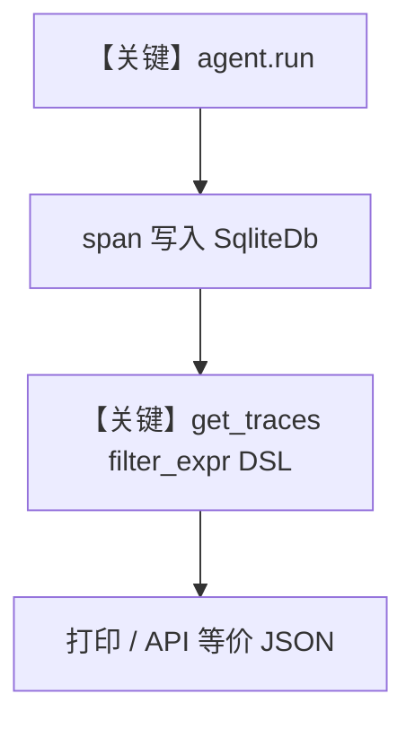

# 08_advanced_trace_filtering.py — 实现原理分析

> 源文件：`cookbook/05_agent_os/tracing/08_advanced_trace_filtering.py`

## 概述

本示例展示 Agno 的 **FilterExpr DSL + `db.get_traces`**：先用两 Agent `run` 产生 trace，再用 `EQ`/`AND`/`CONTAINS` 等算子构造 `filter_expr`，调用 `SqliteDb.get_traces` 做服务端过滤；**非 AgentOS 入口**，核心在 **查询层**。

**核心配置一览：**

| 配置项 | 值 | 说明 |
|--------|------|------|
| `db` | `SqliteDb(db_file="tmp/advanced_filtering.db")` | 存储与查询 |
| `setup_tracing` | `setup_tracing(db=db)` | 手动启用追踪 |
| `news_agent` | `OpenAIChat(gpt-5.2)`, HackerNews | 生成 trace |
| `stock_agent` | `OpenAIChat(gpt-5.2)`, YFinance | 生成 trace |
| `user_id` / `session_id` | 各 Agent 显式设置 | 用于过滤演示 |
| `AgentOS` | 无 | 未使用 |

## 架构分层

```
用户代码层                agno.db / agno.filters
┌──────────────────┐    ┌──────────────────────────────────┐
│ agent.run        │───>│ span 写入 db                      │
│ FilterExpr       │    │ db.get_traces(filter_expr=...)    │
└──────────────────┘    └──────────────────────────────────┘
```

## 核心组件解析

### FilterExpr

`agno.filters` 提供 `EQ`、`AND`、`CONTAINS` 等，可 `to_dict()` 序列化；`db.get_traces` 接收字典化过滤器（本例 `EQ("status","OK").to_dict()` 等）。

### 运行机制与因果链

1. **路径**：`setup_tracing` → `agent.run`（产生数据）→ `get_traces` 读回。
2. **副作用**：仅本地 Sqlite；无 AgentOS。
3. **分支**：不同 filter 影响结果集规模。
4. **定位**：**高级查询与 DSL**，与 HTTP `POST /traces/search` 的 body 结构呼应（脚本 Step 4 打印示例）。

## System Prompt 组装

本脚本 **无 AgentOS**；各 Agent 仍走 `get_system_message()`。以 `news_agent` 为例：

| 组成部分 | 值 | 生效 |
|---------|-----|------|
| `instructions` | `"You are a hacker news agent..."` | 是 |
| `markdown` | `True` | 是 |
| `name` | `"HackerNews Agent"` | 默认不 add_name（`add_name_to_context` 未设） |

### 还原后的完整 System 文本（news_agent 静态段）

```text
You are a hacker news agent. Answer questions concisely.

<additional_information>
- Use markdown to format your answers.
</additional_information>
```

`stock_agent`：

```text
You are a stock analyst. Answer questions concisely.

<additional_information>
- Use markdown to format your answers.
</additional_information>
```

## 完整 API 请求

演示中两次典型调用：

```python
# 参照 run：news_agent.run("What are the top 2 stories on Hacker News?")
client.chat.completions.create(
    model="gpt-5.2",
    messages=[
        {"role": "system", "content": "<news_agent system>"},
        {"role": "user", "content": "What are the top 2 stories on Hacker News?"},
    ],
    tools=[...],  # HackerNewsTools
)
```

## Mermaid 流程图



## 关键源码文件索引

| 文件 | 关键函数/类 | 作用 |
|------|------------|------|
| `agno/tracing/setup.py` | `setup_tracing()` | OT |
| `agno/db/sqlite.py`（或基类） | `get_traces` | 过滤查询 |
| `agno/filters` | `EQ`, `AND`, ... | DSL |
| `agno/agent/_messages.py` | `get_system_message()` L106+ | System |
