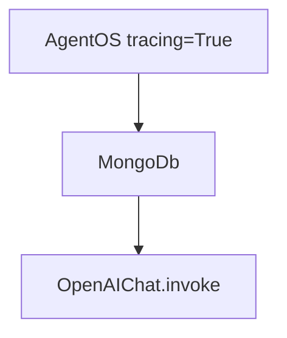

# basic_agent_with_mongodb.py — 实现原理分析

<!-- cookbook-py-source:start -->
## 完整源码

```python
"""
Traces with AgentOS
Requirements:
    uv pip install agno opentelemetry-api opentelemetry-sdk openinference-instrumentation-agno
"""

from agno.agent import Agent
from agno.db.mongo import MongoDb
from agno.models.openai import OpenAIChat
from agno.os import AgentOS
from agno.tools.hackernews import HackerNewsTools

# ---------------------------------------------------------------------------
# Create Example
# ---------------------------------------------------------------------------

# docker run -d -p 27017:27017 --name mongodb mongo:latest
db_url = "mongodb://localhost:27017"

db = MongoDb(db_url=db_url)

agent = Agent(
    name="HackerNews Agent",
    model=OpenAIChat(id="gpt-5.2"),
    tools=[HackerNewsTools()],
    instructions="You are a hacker news agent. Answer questions concisely.",
    markdown=True,
    db=db,
)

# Setup our AgentOS app
agent_os = AgentOS(
    description="Example app for tracing HackerNews",
    agents=[agent],
    tracing=True,
)
app = agent_os.get_app()

# ---------------------------------------------------------------------------
# Run Example
# ---------------------------------------------------------------------------

if __name__ == "__main__":
    agent_os.serve(app="basic_agent_with_mongodb:app", reload=True)
```

<!-- cookbook-py-source:end -->

> 源文件：`cookbook/05_agent_os/tracing/dbs/basic_agent_with_mongodb.py`

## 概述

本示例展示 Agno 的 **MongoDb 作为 Agent 存储 + AgentOS tracing**：`MongoDb(db_url)` 连接本地 Mongo；`AgentOS(tracing=True)` 通过 `_setup_tracing` 选用 Agent 上的 db 作为 trace 导出目标（因未单独传 `AgentOS.db`）。

**核心配置一览：**

| 配置项 | 值 | 说明 |
|--------|------|------|
| `db_url` | `"mongodb://localhost:27017"` | Mongo 连接串 |
| `db` | `MongoDb(db_url=db_url)` | 会话/元数据 |
| `agent` | `OpenAIChat(gpt-5.2)`, `HackerNewsTools` | 与 sqlite 版同构 |
| `agent_os` | `AgentOS(agents=[agent], tracing=True)` | 启用 tracing |
| `description` | `"Example app for tracing HackerNews"` | OS 描述 |

## 架构分层

与 `basic_agent_with_sqlite.md` 相同，仅 **Db 适配器** 由 Sqlite 换为 Mongo（`agno/db/mongo`）。

## 核心组件解析

### MongoDb

持久化实现不同，但对 Agent/OS 抽象均为 `BaseDb` 子类；tracing 导出器只依赖 db 接口写入 span。

### 运行机制与因果链

1. **路径**：`serve` → 请求 → `Agent.run` → `invoke`。
2. **副作用**：Mongo 存会话/trace 记录（依实现）；需本地 `docker run mongo`（注释）。
3. **与 sqlite 版差异**：**后端存储引擎** 与连接串。

## System Prompt 组装

| 组成部分 | 值 | 生效 |
|---------|-----|------|
| `instructions` | `"You are a hacker news agent..."` | 是 |
| `markdown` | `True` | 是 |

### 还原后的完整 System 文本

```text
You are a hacker news agent. Answer questions concisely.

<additional_information>
- Use markdown to format your answers.
</additional_information>
```

## 完整 API 请求

```python
client.chat.completions.create(
    model="gpt-5.2",
    messages=[
        {"role": "system", "content": "<上节>"},
        {"role": "user", "content": "<用户>"},
    ],
    tools=[...],
)
```

## Mermaid 流程图



## 关键源码文件索引

| 文件 | 关键函数/类 | 作用 |
|------|------------|------|
| `agno/os/app.py` | `_setup_tracing()` L616+ | tracing |
| `agno/agent/_messages.py` | `get_system_message()` L106+ | System |
| `agno/models/openai/chat.py` | `invoke()` L385+ | API |
