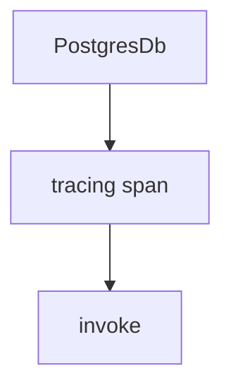

# basic_agent_with_postgresdb.py — 实现原理分析

<!-- cookbook-py-source:start -->
## 完整源码

```python
"""
Traces with AgentOS
Requirements:
    uv pip install agno opentelemetry-api opentelemetry-sdk openinference-instrumentation-agno
"""

from agno.agent import Agent
from agno.db.postgres import PostgresDb
from agno.models.openai import OpenAIChat
from agno.os import AgentOS
from agno.tools.hackernews import HackerNewsTools

# ---------------------------------------------------------------------------
# Create Example
# ---------------------------------------------------------------------------

# Set up database
db = PostgresDb(db_url="postgresql+psycopg://ai:ai@localhost:5532/ai")

agent = Agent(
    name="HackerNews Agent",
    model=OpenAIChat(id="gpt-5.2"),
    tools=[HackerNewsTools()],
    instructions="You are a hacker news agent. Answer questions concisely.",
    markdown=True,
    db=db,
)

# Setup our AgentOS app
agent_os = AgentOS(
    description="Example app for tracing HackerNews",
    agents=[agent],
    tracing=True,
)
app = agent_os.get_app()

# ---------------------------------------------------------------------------
# Run Example
# ---------------------------------------------------------------------------

if __name__ == "__main__":
    agent_os.serve(app="basic_agent_with_postgresdb:app", reload=True)
```

<!-- cookbook-py-source:end -->

> 源文件：`cookbook/05_agent_os/tracing/dbs/basic_agent_with_postgresdb.py`

## 概述

本示例展示 Agno 的 **PostgresDb + AgentOS tracing**：`PostgresDb(db_url=postgresql+psycopg://...)` 作为生产型关系库存储；其余与 Mongo/Sqlite 同构——单 Agent + HackerNews + `tracing=True`。

**核心配置一览：**

| 配置项 | 值 | 说明 |
|--------|------|------|
| `db` | `PostgresDb(db_url="postgresql+psycopg://ai:ai@localhost:5532/ai")` | Postgres |
| `agent` | `OpenAIChat(id="gpt-5.2")`, `HackerNewsTools` | 同系列示例 |
| `markdown` | `True` | Markdown 附加 |
| `agent_os` | `tracing=True` | 启用 tracing |

## 架构分层

同 Mongo 版，仅存储后端为 **PostgreSQL**（`agno/db/postgres`）。

## 核心组件解析

### 运行机制与因果链

与 `basic_agent_with_mongodb.md` 一致；适合作为 **生产环境 tracing** 落库的参考（与 CLAUDE.md「生产用 Postgres」一致）。

## System Prompt 组装

### 还原后的完整 System 文本

```text
You are a hacker news agent. Answer questions concisely.

<additional_information>
- Use markdown to format your answers.
</additional_information>
```

## 完整 API 请求

`OpenAIChat` → `chat.completions.create`（`agno/models/openai/chat.py` L412+），`model="gpt-5.2"`。

## Mermaid 流程图



## 关键源码文件索引

| 文件 | 关键函数/类 | 作用 |
|------|------------|------|
| `agno/db/postgres` | `PostgresDb` | 存储适配 |
| `agno/os/app.py` | `_setup_tracing()` | tracing |
| `agno/agent/_messages.py` | `get_system_message()` L106+ | System |
