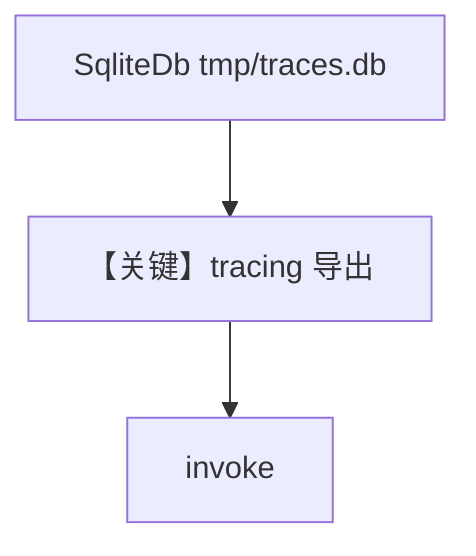

# basic_agent_with_sqlite.py — 实现原理分析

> 源文件：`cookbook/05_agent_os/tracing/dbs/basic_agent_with_sqlite.py`

## 概述

本示例展示 Agno 的 **SqliteDb + AgentOS tracing**：本地文件 `tmp/traces.db` 便于开发调试；`AgentOS(tracing=True)` 与 Agent 共用存储抽象写入 trace。

**核心配置一览：**

| 配置项 | 值 | 说明 |
|--------|------|------|
| `db` | `SqliteDb(db_file="tmp/traces.db")` | 开发用本地库 |
| `agent` | `OpenAIChat(gpt-5.2)`, `HackerNewsTools`, `markdown=True` | 标准演示 Agent |
| `agent_os` | `AgentOS(..., tracing=True)` | 启用 tracing |
| `description` | `"Example app for tracing HackerNews"` | OS 描述 |

## 架构分层

```
用户代码                agno.os + agno.db.sqlite
SqliteDb ──────────────> setup_tracing_for_os(db)
Agent.run ─────────────> OpenAIChat.invoke (chat.py L385+)
```

## 核心组件解析

### 备注（源码笔误）

`if __name__` 中 `agent_os.serve(app="basic_agent_with_postgresdb:app", ...)` 与当前文件名不一致，运行时应改为 `basic_agent_with_sqlite:app` 以避免导入错误。

### 运行机制与因果链

1. **路径**：与 Postgres/Mongo 版相同，仅 **db 驱动** 为 Sqlite。
2. **定位**：**最快本地试 tracing** 的配方。

## System Prompt 组装

### 还原后的完整 System 文本

```text
You are a hacker news agent. Answer questions concisely.

<additional_information>
- Use markdown to format your answers.
</additional_information>
```

## 完整 API 请求

```python
client.chat.completions.create(
    model="gpt-5.2",
    messages=[
        {"role": "system", "content": "<上节>"},
        {"role": "user", "content": "<用户>"},
    ],
    tools=[...],
)
```

## Mermaid 流程图



## 关键源码文件索引

| 文件 | 关键函数/类 | 作用 |
|------|------------|------|
| `agno/db/sqlite.py` | `SqliteDb` | 本地存储 |
| `agno/os/app.py` | `_setup_tracing()` L616+ | tracing |
| `agno/agent/_messages.py` | `get_system_message()` L106+ | System |
