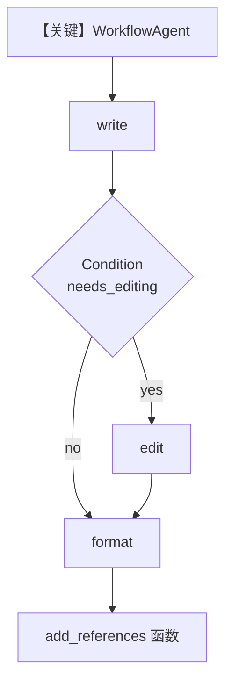

# basic_chat_workflow_agent.py — 实现原理分析

> 源文件：`cookbook/05_agent_os/workflow/basic_chat_workflow_agent.py`

## 概述

本示例展示 Agno 的 **WorkflowAgent + 条件编辑 + 自定义函数步**：`WorkflowAgent` 作为工作流入口模型（`num_history_runs=4`）；`Condition` 根据字数/标点决定是否执行编辑步；最后一步 `add_references` 为普通函数，追加参考文献字符串。

**核心配置一览：**

| 配置项 | 值 | 说明 |
|--------|------|------|
| `story_writer` / `story_editor` / `story_formatter` | `OpenAIChat(gpt-5.2)` | 各步 Agent |
| `workflow_agent` | `WorkflowAgent(model=..., num_history_runs=4)` | 对话式工作流代理 |
| `workflow` | `Workflow(agent=workflow_agent, steps=[write, Condition(...), format, add_references])` | 条件 + 函数步 |
| `db` | `PostgresDb(db_url)` | 会话 |
| `agent_os` | `workflows=[workflow]` | 注册 |

## 架构分层

`WorkflowAgent` 决定何时运行注册的工作流；执行到各 `Step` 时仍调用对应 `Agent.get_system_message()`；`add_references` 无 LLM，纯函数变换。

## 核心组件解析

### WorkflowAgent

将「聊天入口」与「后台工作流」绑定，支持多轮历史（`num_history_runs=4`）。

### Condition `needs_editing`

基于 `previous_step_content` 词数与标点返回是否跑 `edit_step`。

### 运行机制与因果链

1. **路径**：用户对话 → WorkflowAgent 调度 → 步骤链 → LLM/函数。
2. **副作用**：Postgres 持久化。
3. **定位**：**聊天驱动的工作流**，区别于仅 HTTP 触发的一次性工作流。

## System Prompt 组装

各 Agent 独立。`story_writer`：

```text
You are tasked with writing a 100 word story based on a given topic
```

（外加模型默认行为；无 `markdown` 显式设置。）

`WorkflowAgent` 自身另有 Team/Agent 级 `get_system_message`（若适用，见 `agno/workflow` 中 `WorkflowAgent` 实现）。

## 完整 API 请求

各 `OpenAIChat` 子步为 `chat.completions.create`；`WorkflowAgent` 的请求形态需对照 `WorkflowAgent` 所用 `Model` 子类（本例同为 `OpenAIChat`）。

## Mermaid 流程图



## 关键源码文件索引

| 文件 | 作用 |
|------|------|
| `agno/workflow/workflow_agent.py` | `WorkflowAgent` |
| `agno/workflow/condition.py` | `Condition` |
| `agno/agent/_messages.py` | `get_system_message()` |
