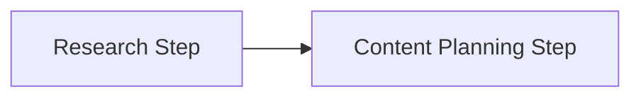

# basic_workflow.py — 实现原理分析

<!-- cookbook-py-source:start -->
## 完整源码

```python
"""
Basic Workflow
==============

Demonstrates basic workflow.
"""

from agno.agent.agent import Agent

# ---------------------------------------------------------------------------
# Create Example
# ---------------------------------------------------------------------------
# Import the workflows
from agno.db.sqlite import SqliteDb
from agno.models.openai.chat import OpenAIChat
from agno.os import AgentOS
from agno.tools.hackernews import HackerNewsTools
from agno.workflow.step import Step
from agno.workflow.workflow import Workflow

# Define agents
hackernews_agent = Agent(
    name="Hackernews Agent",
    model=OpenAIChat(id="gpt-5.2"),
    tools=[HackerNewsTools()],
    role="Extract key insights and content from Hackernews posts",
)

content_planner = Agent(
    name="Content Planner",
    model=OpenAIChat(id="gpt-4o"),
    instructions=[
        "Plan a content schedule over 4 weeks for the provided topic and research content",
        "Ensure that I have posts for 3 posts per week",
    ],
)

# Define steps
research_step = Step(
    name="Research Step",
    agent=hackernews_agent,
)

content_planning_step = Step(
    name="Content Planning Step",
    agent=content_planner,
)

content_creation_workflow = Workflow(
    name="content-creation-workflow",
    description="Automated content creation from blog posts to social media",
    db=SqliteDb(
        session_table="workflow_session",
        db_file="tmp/workflow.db",
    ),
    steps=[research_step, content_planning_step],
)


# Initialize the AgentOS with the workflows
agent_os = AgentOS(
    description="Example OS setup",
    workflows=[content_creation_workflow],
)
app = agent_os.get_app()

# ---------------------------------------------------------------------------
# Run Example
# ---------------------------------------------------------------------------

if __name__ == "__main__":
    agent_os.serve(app="basic_workflow:app", reload=True)
```

<!-- cookbook-py-source:end -->

> 源文件：`cookbook/05_agent_os/workflow/basic_workflow.py`

## 概述

本示例展示 Agno 的 **Workflow + AgentOS 注册**：两个 `Step` 顺序执行（研究 → 内容规划），`Workflow` 绑定 `SqliteDb` 持久化会话，`AgentOS` 仅暴露工作流。

**核心配置一览：**

| 配置项 | 值 | 说明 |
|--------|------|------|
| `hackernews_agent` | `OpenAIChat(gpt-5.2)`, `HackerNewsTools`, `role=...` | 研究步 |
| `content_planner` | `OpenAIChat(gpt-4o)`, `instructions` 列表 | 规划步 |
| `content_creation_workflow` | `Workflow(steps=[research_step, content_planning_step], db=SqliteDb(...))` | 主工作流 |
| `agent_os` | `workflows=[content_creation_workflow]` | 无 tracing 显式设置 |
| `description` | `"Example OS setup"` | OS 描述 |

## 架构分层

```
Workflow 引擎 → Step(Research) → Agent.run → get_system_message → OpenAIChat.invoke
            → Step(Planning)  → 同上
```

## 核心组件解析

### Step 与 Agent

每步将 `step_input` 传给绑定 `Agent`；`hackernews_agent` 用 `role` 提供角色语义（进入 `get_system_message` 的 `# 3.3.2` 若 `role` 存在）。

### 运行机制与因果链

1. **路径**：API 触发工作流 → 顺序执行两步 LLM。
2. **副作用**：`tmp/workflow.db` 会话表 `workflow_session`。
3. **定位**：最简 **线性两步** 模板。

## System Prompt 组装

分步还原。`hackernews_agent` 无 `instructions`，有 `role`：

### 还原后的完整 System 文本（hackernews_agent）

```text
<your_role>
Extract key insights and content from Hackernews posts
</your_role>
```

（另含 `# 3.2.1` markdown 若启用；本示例未设 `markdown`。）

`content_planner` 使用 `instructions` 列表，多段会按 `# 3.3.3` 拼接为多条 `- ...` 行。

## 完整 API 请求

每步一次 `chat.completions.create`（`agno/models/openai/chat.py` L412+），`model` 分别为 `gpt-5.2` 与 `gpt-4o`。

## Mermaid 流程图



## 关键源码文件索引

| 文件 | 作用 |
|------|------|
| `agno/workflow/workflow.py` | `Workflow` 编排 |
| `agno/agent/_messages.py` | `get_system_message()` L106+ |
| `agno/models/openai/chat.py` | `invoke()` L385+ |
