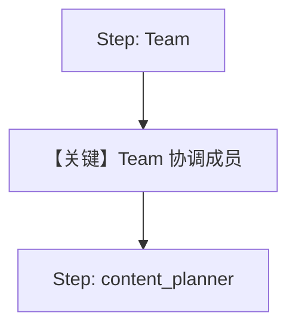

# basic_workflow_team.py — 实现原理分析

> 源文件：`cookbook/05_agent_os/workflow/basic_workflow_team.py`

## 概述

本示例展示 Agno 的 **Workflow Step 绑定 Team**：第一步 `Step(team=research_team)` 由 `Team` 协调 `hackernews_agent` 与 `web_agent`；第二步 `content_planner` 单 Agent。

**核心配置一览：**

| 配置项 | 值 | 说明 |
|--------|------|------|
| `research_team` | `Team(members=[...], instructions=...)` | 无显式 `model` 时需依赖默认或运行时注入 |
| `hackernews_agent` | `gpt-4o-mini`, `HackerNewsTools`, `role` | 成员 |
| `web_agent` | `gpt-4o-mini`, `WebSearchTools`, `role` | 成员 |
| `content_planner` | `gpt-4o`, `instructions` 列表 | 第二步 |
| `steps` | `[research_step, content_planning_step]` | 顺序 |
| `db` | `SqliteDb(tmp/workflow.db)` | 持久化 |

## 架构分层

第一步进入 **Team.run** 路径（`agno/team/team.py`），Team 使用 `get_system_message()`（`agno/team/_messages.py` L328+）；成员被调用时各自 Agent system。

## 核心组件解析

### Team 与成员

Team 级 `instructions` 与成员 `role`/`instructions` 分层约束协调行为与专家分工。

### 运行机制与因果链

1. **路径**：工作流 → Team 步 → 多成员 LLM 调度 → 规划步。
2. **注意**：若 `Team.model` 未配置，运行可能失败——生产环境应为 `Team` 显式设置 `model`。

## System Prompt 组装

### Team（research_team）

走 `team/_messages.py` 默认拼装；`instructions="Research tech topics from Hackernews and the web"` 生效。

### 成员 Agent

例如 `hackernews_agent` 含 `role` 无 `instructions`，则 system 以 `<your_role>` 块为主（`agent/_messages.py` `# 3.3.2`）。

## 完整 API 请求

Team 主循环中模型调用形态见 `Team` 所用 `model`；成员调用为各自 `OpenAIChat` → `chat.completions.create`。

## Mermaid 流程图

## 关键源码文件索引

| 文件 | 作用 |
|------|------|
| `agno/team/team.py` | `Team` 运行 |
| `agno/team/_messages.py` | `get_system_message()` L328+ |
| `agno/workflow/workflow.py` | `Workflow` |
