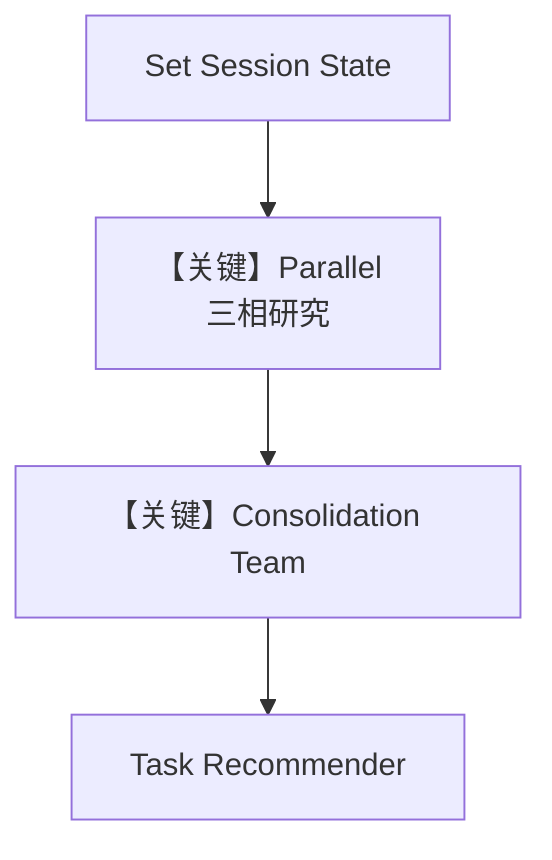

# customer_research_workflow_parallel.py — 实现原理分析

> 源文件：`cookbook/05_agent_os/workflow/customer_research_workflow_parallel.py`

## 概述

本示例展示 Agno 的 **大规模客户研究流水线**：`Parallel` 并行三步异步研究（客户画像 / 业务目标 / 网络情报），每步用带 `output_schema` 的 `Agent` 或 `Team` 流式 `arun`；`session_state` 在自定义 `executor` 间传递；最后整合与任务推荐步再次流式调用。

**核心配置一览：**

| 配置项 | 值 | 说明 |
|--------|------|------|
| Pydantic 模型 | `CustomerProfileResearch` 等 | 结构化输出约束 |
| `customer_profile_agent` 等 | `output_schema` + `WebSearchTools` 等 | 三并行研究 Agent |
| `research_consolidation_team` | `Team` + `output_schema=ConsolidatedResearch` | 汇总 |
| `task_recommender_agent` | 无 schema（长 instructions） | 推荐步 |
| `Parallel(...)` | 三步研究并行 | `agno/workflow/parallel.py` |
| `db` | 子 Agent `InMemoryDb`，工作流 `SqliteDb(customer_research_workflow.db)` | 分层存储 |

## 架构分层

```
set_session_state → Parallel(3x async executor) → consolidation (Team) → task_recommender
                      └→ 各 agent.arun(stream) → yield WorkflowRunOutputEvent
```

## 核心组件解析

### 异步 Step executor

`customer_profile_research_step` 等使用 `AsyncIterator` 产出 `WorkflowRunOutputEvent` 与最终 `StepOutput`，实现 **工作流级流式**（`stream_events=True`）。

### session_state

`set_session_state_step` 初始化嵌套 dict；后续步读写 `research_phases`、`consolidated_insights` 等。

### 运行机制与因果链

1. **数据进/出**：输入为客户研究 query → 并行三相 → Team 合并 → 推荐文本。
2. **副作用**：Sqlite 工作流会话；InMemory 仅进程内；多次 `arun` 产生大量模型调用与工具调用。
3. **关键分支**：任一步异常会标记 phase `failed` 并 `StepOutput(success=False)`。
4. **定位**：cookbook 中 **并行 + 结构化输出 + session + 流式** 的集成样板。

## System Prompt 组装

不存在单一全局 Agent。各 `instructions` 为多行列表字符串，进入 `get_system_message` `# 3.3.3`；`output_schema` 触发 JSON/结构化相关附加提示（见 `get_system_message` 后部与 `team/_messages` 对 schema 的处理）。

### 还原示例（customer_profile_agent 指令列表拼接形态）

列表项会拼成多条 `- ...` 或合并为单段，依 `use_instruction_tags`；默认可还原为下列条文连续出现：

- `You are an expert customer profile researcher specializing in comprehensive customer analysis`
- （其余列表项同源码 L161–169）

完整逐字还原请直接对照源码 L157–170、174–188、192–207、211–224、229–241；篇幅原因此处不重复粘贴数千字。

## 完整 API 请求

每步 `OpenAIChat` 使用 `chat.completions.create`（或异步 `ainvoke` 路径）；流式时为 chunked SSE/异步流，见 `chat.py` `invoke_stream`/`ainvoke`。

## Mermaid 流程图



## 关键源码文件索引

| 文件 | 作用 |
|------|------|
| `agno/workflow/parallel.py` | `Parallel` |
| `agno/workflow/step.py` | `Step`, `StepOutput` |
| `agno/agent/_messages.py` | `get_system_message()` |
| `agno/models/openai/chat.py` | `ainvoke` / 流式 |
