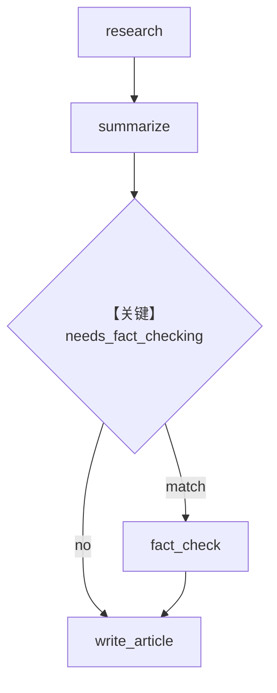

# workflow_with_conditional.py — 实现原理分析

<!-- cookbook-py-source:start -->
## 完整源码

```python
"""
Workflow With Conditional
=========================

Demonstrates workflow with conditional.
"""

from agno.agent.agent import Agent
from agno.db.sqlite import SqliteDb

# ---------------------------------------------------------------------------
# Create Example
# ---------------------------------------------------------------------------
# Import the workflows
from agno.os import AgentOS
from agno.tools.websearch import WebSearchTools
from agno.workflow.condition import Condition
from agno.workflow.step import Step
from agno.workflow.types import StepInput
from agno.workflow.workflow import Workflow

# === BASIC AGENTS ===
researcher = Agent(
    name="Researcher",
    instructions="Research the given topic and provide detailed findings.",
    tools=[WebSearchTools()],
)

summarizer = Agent(
    name="Summarizer",
    instructions="Create a clear summary of the research findings.",
)

fact_checker = Agent(
    name="Fact Checker",
    instructions="Verify facts and check for accuracy in the research.",
    tools=[WebSearchTools()],
)

writer = Agent(
    name="Writer",
    instructions="Write a comprehensive article based on all available research and verification.",
)

# === CONDITION EVALUATOR ===


def needs_fact_checking(step_input: StepInput) -> bool:
    """Determine if the research contains claims that need fact-checking"""
    summary = step_input.previous_step_content or ""

    # Look for keywords that suggest factual claims
    fact_indicators = [
        "study shows",
        "research indicates",
        "according to",
        "statistics",
        "data shows",
        "survey",
        "report",
        "million",
        "billion",
        "percent",
        "%",
        "increase",
        "decrease",
    ]

    return any(indicator in summary.lower() for indicator in fact_indicators)


# === WORKFLOW STEPS ===
research_step = Step(
    name="research",
    description="Research the topic",
    agent=researcher,
)

summarize_step = Step(
    name="summarize",
    description="Summarize research findings",
    agent=summarizer,
)

# Conditional fact-checking step
fact_check_step = Step(
    name="fact_check",
    description="Verify facts and claims",
    agent=fact_checker,
)

write_article = Step(
    name="write_article",
    description="Write final article",
    agent=writer,
)

# === BASIC LINEAR WORKFLOW ===
basic_workflow = Workflow(
    name="basic-linear-workflow",
    description="Research -> Summarize -> Condition(Fact Check) -> Write Article",
    steps=[
        research_step,
        summarize_step,
        Condition(
            name="fact_check_condition",
            description="Check if fact-checking is needed",
            evaluator=needs_fact_checking,
            steps=[fact_check_step],
        ),
        write_article,
    ],
    db=SqliteDb(
        session_table="workflow_session",
        db_file="tmp/workflow.db",
    ),
)

# Initialize the AgentOS with the workflows
agent_os = AgentOS(
    description="Example OS setup",
    workflows=[basic_workflow],
)
app = agent_os.get_app()

# ---------------------------------------------------------------------------
# Run Example
# ---------------------------------------------------------------------------

if __name__ == "__main__":
    agent_os.serve(app="workflow_with_conditional:app", reload=True)
```

<!-- cookbook-py-source:end -->

> 源文件：`cookbook/05_agent_os/workflow/workflow_with_conditional.py`

## 概述

本示例展示 Agno 的 **Condition 按摘要内容决定是否核查**：`needs_fact_checking` 检测 `previous_step_content` 是否含统计、引用类关键词，动态插入 `fact_check_step`。

**核心配置一览：**

| 配置项 | 值 | 说明 |
|--------|------|------|
| `researcher` 等 | 多数 **无显式 model** | 需环境默认或自行补全 |
| `Condition` | `evaluator=needs_fact_checking`, `steps=[fact_check_step]` | 条件步 |
| `db` | `SqliteDb(workflow.db, session_table=workflow_session)` | 持久化 |

## 架构分层

线性：`research` → `summarize` → `Condition` → `write_article`。

## 核心组件解析

### needs_fact_checking

关键词表驱动；若摘要无触发词则 **跳过** 事实核查步，与 `05_basic_workflow_tracing`（恒 True）形成对照。

## System Prompt 组装

`researcher`：

```text
Research the given topic and provide detailed findings.
```

（外加工具说明段；无 `markdown` 显式设置。）

## 完整 API 请求

每步 Agent 若配置 `OpenAIChat`，则为 `chat.completions.create`；未配置 model 时运行前须补全。

## Mermaid 流程图



## 关键源码文件索引

| 文件 | 作用 |
|------|------|
| `agno/workflow/condition.py` | `Condition` |
| `agno/agent/_messages.py` | `get_system_message()` |
