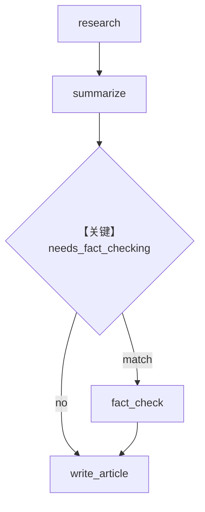

# workflow_with_conditional.py — 实现原理分析

> 源文件：`cookbook/05_agent_os/workflow/workflow_with_conditional.py`

## 概述

本示例展示 Agno 的 **Condition 按摘要内容决定是否核查**：`needs_fact_checking` 检测 `previous_step_content` 是否含统计、引用类关键词，动态插入 `fact_check_step`。

**核心配置一览：**

| 配置项 | 值 | 说明 |
|--------|------|------|
| `researcher` 等 | 多数 **无显式 model** | 需环境默认或自行补全 |
| `Condition` | `evaluator=needs_fact_checking`, `steps=[fact_check_step]` | 条件步 |
| `db` | `SqliteDb(workflow.db, session_table=workflow_session)` | 持久化 |

## 架构分层

线性：`research` → `summarize` → `Condition` → `write_article`。

## 核心组件解析

### needs_fact_checking

关键词表驱动；若摘要无触发词则 **跳过** 事实核查步，与 `05_basic_workflow_tracing`（恒 True）形成对照。

## System Prompt 组装

`researcher`：

```text
Research the given topic and provide detailed findings.
```

（外加工具说明段；无 `markdown` 显式设置。）

## 完整 API 请求

每步 Agent 若配置 `OpenAIChat`，则为 `chat.completions.create`；未配置 model 时运行前须补全。

## Mermaid 流程图



## 关键源码文件索引

| 文件 | 作用 |
|------|------|
| `agno/workflow/condition.py` | `Condition` |
| `agno/agent/_messages.py` | `get_system_message()` |
