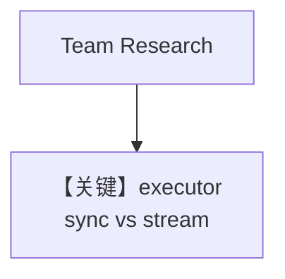

# workflow_with_custom_function.py — 实现原理分析

> 源文件：`cookbook/05_agent_os/workflow/workflow_with_custom_function.py`

## 概述

本示例展示 Agno 的 **自定义 Step executor（同步 / 异步流式）**：`USE_STREAMING_WORKFLOW` 在 Postgres+同步函数 与 Sqlite+异步流式函数 两套 Workflow 间切换；研究步用 `Team`，规划步用 `executor` 调用内部 `Agent.run` / `arun`。

**核心配置一览：**

| 配置项 | 值 | 说明 |
|--------|------|------|
| `USE_STREAMING_WORKFLOW` | `False`（默认同步链路） | 切换注册 |
| `sync_content_creation_workflow` | `PostgresDb`, `custom_content_planning_function` | 同步 executor |
| `streaming_content_creation_workflow` | `SqliteDb`, `streaming_custom_content_planning_function` | 异步流式 executor |
| `research_team` | `Team` + 两 Agent | 第一步 |

## 架构分层

`Step(executor=...)` 不走默认 Agent 消息组装，而是在函数内拼 `planning_prompt` 再调用 `content_planner.run`/`arun`。

## 核心组件解析

### 自定义 executor

`custom_content_planning_function` 返回 `StepOutput`；流式版 `yield` 子 Agent 的 `WorkflowRunOutputEvent` 再 `yield StepOutput`。

### 运行机制与因果链

1. **路径**：Team 研究 → 函数步调用子 Agent。
2. **副作用**：Postgres 或 Sqlite 依所选工作流。
3. **定位**：**自定义代码 orchestrate 子 Agent**，演示同步/流式两种写法。

## System Prompt 组装

子 Agent `sync_content_planner` 使用 `instructions` 列表（与 basic_workflow 类似）。**用户消息**在 executor 内被拼进 `planning_prompt`，而非裸用户句。

### 还原（content_planner instructions）

```text
Plan a content schedule over 4 weeks for the provided topic and research content
Ensure that I have posts for 3 posts per week
```

（多行列表默认拼接为多 `-` 行或单段，见 `_messages.py`。）

## 完整 API 请求

`sync_content_planner.run(planning_prompt)` 内部 → `OpenAIChat.invoke` → `chat.completions.create`。

## Mermaid 流程图



## 关键源码文件索引

| 文件 | 作用 |
|------|------|
| `agno/workflow/step.py` | `Step` executor |
| `agno/agent/agent.py` | `run` / `arun` |
