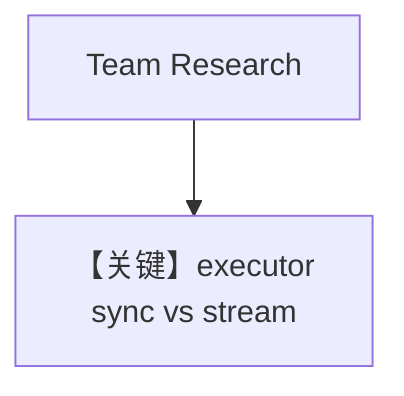

# workflow_with_custom_function.py — 实现原理分析

<!-- cookbook-py-source:start -->
## 完整源码

```python
"""
Workflow With Custom Function Executors
=======================================

Demonstrates AgentOS workflows using both sync and streaming custom function steps.
"""

from typing import AsyncIterator, Union

from agno.agent import Agent
from agno.db.in_memory import InMemoryDb
from agno.db.postgres import PostgresDb
from agno.db.sqlite import SqliteDb
from agno.models.openai import OpenAIChat
from agno.os import AgentOS
from agno.team import Team
from agno.tools.hackernews import HackerNewsTools
from agno.tools.websearch import WebSearchTools
from agno.workflow.step import Step, StepInput, StepOutput, WorkflowRunOutputEvent
from agno.workflow.workflow import Workflow

# ---------------------------------------------------------------------------
# Setup
# ---------------------------------------------------------------------------
USE_STREAMING_WORKFLOW = False

db_url = "postgresql+psycopg://ai:ai@localhost:5532/ai"

# ---------------------------------------------------------------------------
# Create Agents And Team
# ---------------------------------------------------------------------------
hackernews_agent = Agent(
    name="Hackernews Agent",
    model=OpenAIChat(id="gpt-4o"),
    tools=[HackerNewsTools()],
    instructions="Extract key insights and content from Hackernews posts",
)

web_agent = Agent(
    name="Web Agent",
    model=OpenAIChat(id="gpt-4o"),
    tools=[WebSearchTools()],
    instructions="Search the web for the latest news and trends",
)

research_team = Team(
    name="Research Team",
    members=[hackernews_agent, web_agent],
    instructions="Analyze content and create comprehensive social media strategy",
)

sync_content_planner = Agent(
    name="Content Planner",
    model=OpenAIChat(id="gpt-4o"),
    instructions=[
        "Plan a content schedule over 4 weeks for the provided topic and research content",
        "Ensure that I have posts for 3 posts per week",
    ],
)

streaming_content_planner = Agent(
    name="Content Planner",
    model=OpenAIChat(id="gpt-4o"),
    instructions=[
        "Plan a content schedule over 4 weeks for the provided topic and research content",
        "Ensure that I have posts for 3 posts per week",
    ],
    db=InMemoryDb(),
)


# ---------------------------------------------------------------------------
# Create Custom Functions
# ---------------------------------------------------------------------------
def custom_content_planning_function(step_input: StepInput) -> StepOutput:
    """Create a content plan using prior workflow context."""
    message = step_input.input
    previous_step_content = step_input.previous_step_content

    planning_prompt = f"""
        STRATEGIC CONTENT PLANNING REQUEST:

        Core Topic: {message}

        Research Results: {previous_step_content[:500] if previous_step_content else "No research results"}

        Planning Requirements:
        1. Create a comprehensive content strategy based on the research
        2. Leverage the research findings effectively
        3. Identify content formats and channels
        4. Provide timeline and priority recommendations
        5. Include engagement and distribution strategies

        Please create a detailed, actionable content plan.
    """

    try:
        response = sync_content_planner.run(planning_prompt)
        enhanced_content = f"""
            ## Strategic Content Plan

            **Planning Topic:** {message}

            **Research Integration:** {"Research-based" if previous_step_content else "No research foundation"}

            **Content Strategy:**
            {response.content}

            **Custom Planning Enhancements:**
            - Research Integration: {"High" if previous_step_content else "Baseline"}
            - Strategic Alignment: Optimized for multi-channel distribution
            - Execution Ready: Detailed action items included
        """.strip()
        return StepOutput(content=enhanced_content)
    except Exception as exc:
        return StepOutput(
            content=f"Custom content planning failed: {str(exc)}", success=False
        )


async def streaming_custom_content_planning_function(
    step_input: StepInput,
) -> AsyncIterator[Union[WorkflowRunOutputEvent, StepOutput]]:
    """Create a content plan with streamed planner output events."""
    message = step_input.input
    previous_step_content = step_input.previous_step_content

    planning_prompt = f"""
        STRATEGIC CONTENT PLANNING REQUEST:

        Core Topic: {message}

        Research Results: {previous_step_content[:500] if previous_step_content else "No research results"}

        Planning Requirements:
        1. Create a comprehensive content strategy based on the research
        2. Leverage the research findings effectively
        3. Identify content formats and channels
        4. Provide timeline and priority recommendations
        5. Include engagement and distribution strategies

        Please create a detailed, actionable content plan.
    """

    try:
        response_iterator = streaming_content_planner.arun(
            planning_prompt,
            stream=True,
            stream_events=True,
        )
        async for event in response_iterator:
            yield event

        response = streaming_content_planner.get_last_run_output()
        enhanced_content = f"""
            ## Strategic Content Plan

            **Planning Topic:** {message}

            **Research Integration:** {"Research-based" if previous_step_content else "No research foundation"}

            **Content Strategy:**
            {response.content}

            **Custom Planning Enhancements:**
            - Research Integration: {"High" if previous_step_content else "Baseline"}
            - Strategic Alignment: Optimized for multi-channel distribution
            - Execution Ready: Detailed action items included
        """.strip()
        yield StepOutput(content=enhanced_content)
    except Exception as exc:
        yield StepOutput(
            content=f"Custom content planning failed: {str(exc)}", success=False
        )


# ---------------------------------------------------------------------------
# Create Workflows
# ---------------------------------------------------------------------------
sync_content_creation_workflow = Workflow(
    name="Content Creation Workflow",
    description="Automated content creation with custom execution options",
    db=PostgresDb(
        session_table="workflow_session",
        db_url=db_url,
    ),
    steps=[
        Step(
            name="Research Step",
            team=research_team,
        ),
        Step(
            name="Content Planning Step",
            executor=custom_content_planning_function,
        ),
    ],
)

streaming_content_creation_workflow = Workflow(
    name="Streaming Content Creation Workflow",
    description="Automated content creation with streaming custom execution functions",
    db=SqliteDb(
        session_table="workflow_session",
        db_file="tmp/workflow.db",
    ),
    steps=[
        Step(
            name="Research Step",
            team=research_team,
        ),
        Step(
            name="Content Planning Step",
            executor=streaming_custom_content_planning_function,
        ),
    ],
)

# ---------------------------------------------------------------------------
# Create AgentOS
# ---------------------------------------------------------------------------
agent_os = AgentOS(
    description="Example app for basic agent with playground capabilities",
    workflows=[
        streaming_content_creation_workflow
        if USE_STREAMING_WORKFLOW
        else sync_content_creation_workflow
    ],
)
app = agent_os.get_app()

# ---------------------------------------------------------------------------
# Run
# ---------------------------------------------------------------------------
if __name__ == "__main__":
    agent_os.serve(app="workflow_with_custom_function:app", reload=True)
```

<!-- cookbook-py-source:end -->

> 源文件：`cookbook/05_agent_os/workflow/workflow_with_custom_function.py`

## 概述

本示例展示 Agno 的 **自定义 Step executor（同步 / 异步流式）**：`USE_STREAMING_WORKFLOW` 在 Postgres+同步函数 与 Sqlite+异步流式函数 两套 Workflow 间切换；研究步用 `Team`，规划步用 `executor` 调用内部 `Agent.run` / `arun`。

**核心配置一览：**

| 配置项 | 值 | 说明 |
|--------|------|------|
| `USE_STREAMING_WORKFLOW` | `False`（默认同步链路） | 切换注册 |
| `sync_content_creation_workflow` | `PostgresDb`, `custom_content_planning_function` | 同步 executor |
| `streaming_content_creation_workflow` | `SqliteDb`, `streaming_custom_content_planning_function` | 异步流式 executor |
| `research_team` | `Team` + 两 Agent | 第一步 |

## 架构分层

`Step(executor=...)` 不走默认 Agent 消息组装，而是在函数内拼 `planning_prompt` 再调用 `content_planner.run`/`arun`。

## 核心组件解析

### 自定义 executor

`custom_content_planning_function` 返回 `StepOutput`；流式版 `yield` 子 Agent 的 `WorkflowRunOutputEvent` 再 `yield StepOutput`。

### 运行机制与因果链

1. **路径**：Team 研究 → 函数步调用子 Agent。
2. **副作用**：Postgres 或 Sqlite 依所选工作流。
3. **定位**：**自定义代码 orchestrate 子 Agent**，演示同步/流式两种写法。

## System Prompt 组装

子 Agent `sync_content_planner` 使用 `instructions` 列表（与 basic_workflow 类似）。**用户消息**在 executor 内被拼进 `planning_prompt`，而非裸用户句。

### 还原（content_planner instructions）

```text
Plan a content schedule over 4 weeks for the provided topic and research content
Ensure that I have posts for 3 posts per week
```

（多行列表默认拼接为多 `-` 行或单段，见 `_messages.py`。）

## 完整 API 请求

`sync_content_planner.run(planning_prompt)` 内部 → `OpenAIChat.invoke` → `chat.completions.create`。

## Mermaid 流程图



## 关键源码文件索引

| 文件 | 作用 |
|------|------|
| `agno/workflow/step.py` | `Step` executor |
| `agno/agent/agent.py` | `run` / `arun` |
