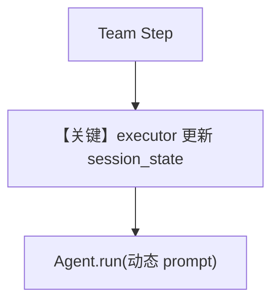

# workflow_with_custom_function_updating_session_state.py — 实现原理分析

<!-- cookbook-py-source:start -->
## 完整源码

```python
"""
Workflow With Custom Function Updating Session State
====================================================

Demonstrates workflow with custom function updating session state.
"""

from agno.agent import Agent
from agno.db.sqlite import SqliteDb
from agno.models.openai import OpenAIChat
from agno.os import AgentOS
from agno.run import RunContext
from agno.team import Team
from agno.tools.hackernews import HackerNewsTools
from agno.tools.websearch import WebSearchTools
from agno.workflow.step import Step, StepInput, StepOutput
from agno.workflow.workflow import Workflow

# ---------------------------------------------------------------------------
# Create Example
# ---------------------------------------------------------------------------

db_url = "postgresql+psycopg://ai:ai@localhost:5532/ai"

# Define agents
hackernews_agent = Agent(
    name="Hackernews Agent",
    model=OpenAIChat(id="gpt-4o"),
    tools=[HackerNewsTools()],
    instructions="Extract key insights and content from Hackernews posts",
)

web_agent = Agent(
    name="Web Agent",
    model=OpenAIChat(id="gpt-4o"),
    tools=[WebSearchTools()],
    instructions="Search the web for the latest news and trends",
)

# Define research team for complex analysis
research_team = Team(
    name="Research Team",
    members=[hackernews_agent, web_agent],
    instructions="Analyze content and create comprehensive social media strategy",
)

content_planner = Agent(
    name="Content Planner",
    model=OpenAIChat(id="gpt-4o"),
    instructions=[
        "Plan a content schedule over 4 weeks for the provided topic and research content",
        "Ensure that I have posts for 3 posts per week",
    ],
)


def custom_content_planning_function(
    step_input: StepInput, run_context: RunContext
) -> StepOutput:
    if run_context.session_state is None:
        run_context.session_state = {}

    """
    Custom function that does intelligent content planning with session state tracking
    """
    message = step_input.input
    previous_step_content = step_input.previous_step_content

    # Initialize session state for content planning if not exists
    if "content_planning" not in run_context.session_state:
        run_context.session_state["content_planning"] = {
            "total_plans_created": 0,
            "topics_processed": [],
            "planning_history": [],
        }

    # Track this planning request
    run_context.session_state["content_planning"]["total_plans_created"] += 1
    run_context.session_state["content_planning"]["topics_processed"].append(
        str(message)
    )

    # Use session state data to enhance planning
    planning_context = run_context.session_state["content_planning"]
    previous_topics = planning_context["topics_processed"][:-1]  # Exclude current topic

    # Extract workflow configuration and user preferences
    workflow_config = run_context.session_state.get("workflow_config", {})
    user_preferences = run_context.session_state.get("user_preferences", {})

    # Create intelligent planning prompt with session context
    planning_prompt = f"""
        STRATEGIC CONTENT PLANNING REQUEST #{planning_context["total_plans_created"]}:

        Core Topic: {message}
        Research Results: {previous_step_content[:500] if previous_step_content else "No research results"}
        Session Context: {"First-time planning" if planning_context["total_plans_created"] == 1 else f"Building on {len(previous_topics)} previous topics: {', '.join(previous_topics[-3:])}"}

        Workflow Configuration:
        - Environment: {workflow_config.get("environment", "unknown")}
        - Content Goals: {", ".join(workflow_config.get("content_goals", []))}
        - Created By: {workflow_config.get("created_by", "system")}

        User Preferences:
        - Content Style: {user_preferences.get("content_style", "default")}
        - Target Audience: {user_preferences.get("target_audience", "general")}
        - Posting Frequency: {user_preferences.get("posting_frequency", "regular")}

        Planning Requirements:
        1. Create a comprehensive content strategy based on the research
        2. Leverage the research findings effectively
        3. Consider previous planning context for consistency
        4. Align with specified content goals and target audience
        5. Match the preferred content style and posting frequency
        6. Identify content formats and channels
        7. Provide timeline and priority recommendations
        8. Include engagement and distribution strategies

        Please create a detailed, actionable content plan that incorporates all session context.
    """

    try:
        response = content_planner.run(planning_prompt)

        # Store planning result in session state
        planning_result = {
            "topic": str(message),
            "timestamp": "current_session",
            "success": True,
            "content_length": len(str(response.content)),
        }
        run_context.session_state["content_planning"]["planning_history"].append(
            planning_result
        )

        enhanced_content = f"""
            ## Strategic Content Plan #{planning_context["total_plans_created"]}
            **Planning Topic:** {message}
            **Session Context:** {len(previous_topics)} previous topics planned
            **Research Integration:** {"✓ Research-based" if previous_step_content else "✗ No research foundation"}

            **Content Strategy:**
            {response.content}

            **Session-Enhanced Features:**
            - Plan Number: {planning_context["total_plans_created"]}
            - Context Awareness: {"Multi-topic session" if len(previous_topics) > 0 else "Initial planning session"}
            - Environment: {workflow_config.get("environment", "unknown")}
            - Target Audience: {user_preferences.get("target_audience", "general")}
            - Content Style: {user_preferences.get("content_style", "default")}
            - Content Goals: {", ".join(workflow_config.get("content_goals", []))}
            - Strategic Alignment: Optimized for multi-channel distribution
            - Execution Ready: Detailed action items included

            **Session State Summary:**
            - Total plans: {planning_context["total_plans_created"]}
            - Topics covered: {", ".join(planning_context["topics_processed"])}
            - Workflow creator: {workflow_config.get("created_by", "system")}
            - Posting frequency: {user_preferences.get("posting_frequency", "regular")}
            - Planning history: {len(planning_context["planning_history"])} recorded sessions
        """.strip()

        print("--> session state", run_context.session_state)

        return StepOutput(content=enhanced_content)

    except Exception as e:
        # Track failed planning in session state
        run_context.session_state["content_planning"]["planning_history"].append(
            {
                "topic": str(message),
                "timestamp": "current_session",
                "success": False,
                "error": str(e),
            }
        )

        return StepOutput(
            content=f"Custom content planning failed: {str(e)}",
            success=False,
        )


# Define steps using different executor types

research_step = Step(
    name="Research Step",
    team=research_team,
)

content_planning_step = Step(
    name="Content Planning Step",
    executor=custom_content_planning_function,
)

content_creation_workflow = Workflow(
    name="Content Creation Workflow",
    description="Automated content creation with custom execution options",
    db=SqliteDb(
        session_table="workflow_session_123243",
        db_file="tmp/workflow.db",
    ),
    steps=[content_planning_step],
    session_state={
        "workflow_config": {
            "created_by": "content_team",
            "environment": "production",
            "content_goals": ["engagement", "brand_awareness", "lead_generation"],
        },
        "user_preferences": {
            "content_style": "professional",
            "target_audience": "business_professionals",
            "posting_frequency": "3_times_per_week",
        },
    },
)

# Initialize the AgentOS with the workflows
agent_os = AgentOS(
    description="Example app for basic agent with playground capabilities",
    workflows=[content_creation_workflow],
)
app = agent_os.get_app()

# ---------------------------------------------------------------------------
# Run Example
# ---------------------------------------------------------------------------

if __name__ == "__main__":
    agent_os.serve(
        app="workflow_with_custom_function_updating_session_state:app", reload=True
    )
```

<!-- cookbook-py-source:end -->

> 源文件：`cookbook/05_agent_os/workflow/workflow_with_custom_function_updating_session_state.py`

## 概述

本示例在 **workflow_with_custom_function** 基础上强调 **`run_context.session_state` 累积**：自定义函数接收 `RunContext`，维护 `content_planning` 计数与 `topics_processed`，并把会话偏好拼进 `planning_prompt`。

**核心配置一览：**

| 配置项 | 值 | 说明 |
|--------|------|------|
| `custom_content_planning_function(step_input, run_context)` | 读写 `session_state` | 与仅 `StepInput` 版本对比 |
| `research_team` | 同系列 | Team 研究步 |
| `db` | `SqliteDb(session_table=workflow_session_123243, db_file=tmp/workflow.db)` | 会话 |
| `steps` | 仅 `[content_planning_step]` | `research_step` 已定义但未加入 `steps`（示例可能用于扩展） |
| `session_state` | `Workflow` 构造参数内联初始 dict | 预置 workflow_config / user_preferences |

## 架构分层

执行器层显式变异 `run_context.session_state`，后续同一会话可复用历史主题与配置键 `workflow_config` / `user_preferences`。

## 核心组件解析

### session_state 结构

`content_planning.total_plans_created`、`topics_processed`、`planning_history` 等在多次工作流重入时可延续（同会话前提下）。

## System Prompt 组装

动态部分占主：`planning_prompt` 含 Session Context、Workflow Configuration、User Preferences 等 **运行时字符串**；静态 Agent `instructions` 仍为 `content_planner` 列表（见源码）。

## 完整 API 请求

`content_planner.run(planning_prompt)` → `chat.completions.create`；`message` 内容来自 f-string 模板。

## Mermaid 流程图



## 关键源码文件索引

| 文件 | 作用 |
|------|------|
| `agno/run/context.py` | `RunContext` |
| `agno/workflow/step.py` | `StepInput` / executor 签名 |
