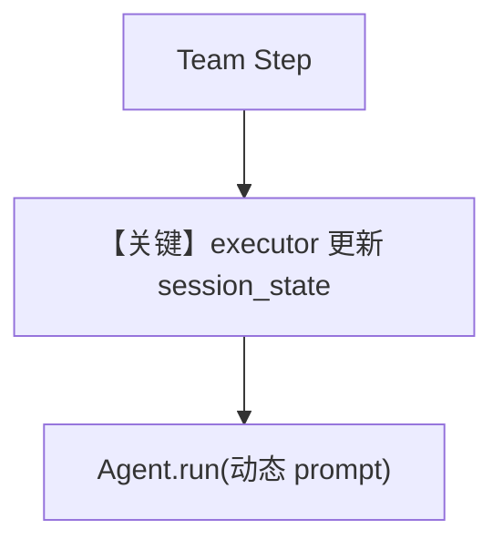

# workflow_with_custom_function_updating_session_state.py — 实现原理分析

> 源文件：`cookbook/05_agent_os/workflow/workflow_with_custom_function_updating_session_state.py`

## 概述

本示例在 **workflow_with_custom_function** 基础上强调 **`run_context.session_state` 累积**：自定义函数接收 `RunContext`，维护 `content_planning` 计数与 `topics_processed`，并把会话偏好拼进 `planning_prompt`。

**核心配置一览：**

| 配置项 | 值 | 说明 |
|--------|------|------|
| `custom_content_planning_function(step_input, run_context)` | 读写 `session_state` | 与仅 `StepInput` 版本对比 |
| `research_team` | 同系列 | Team 研究步 |
| `db` | `SqliteDb(session_table=workflow_session_123243, db_file=tmp/workflow.db)` | 会话 |
| `steps` | 仅 `[content_planning_step]` | `research_step` 已定义但未加入 `steps`（示例可能用于扩展） |
| `session_state` | `Workflow` 构造参数内联初始 dict | 预置 workflow_config / user_preferences |

## 架构分层

执行器层显式变异 `run_context.session_state`，后续同一会话可复用历史主题与配置键 `workflow_config` / `user_preferences`。

## 核心组件解析

### session_state 结构

`content_planning.total_plans_created`、`topics_processed`、`planning_history` 等在多次工作流重入时可延续（同会话前提下）。

## System Prompt 组装

动态部分占主：`planning_prompt` 含 Session Context、Workflow Configuration、User Preferences 等 **运行时字符串**；静态 Agent `instructions` 仍为 `content_planner` 列表（见源码）。

## 完整 API 请求

`content_planner.run(planning_prompt)` → `chat.completions.create`；`message` 内容来自 f-string 模板。

## Mermaid 流程图

## 关键源码文件索引

| 文件 | 作用 |
|------|------|
| `agno/run/context.py` | `RunContext` |
| `agno/workflow/step.py` | `StepInput` / executor 签名 |
