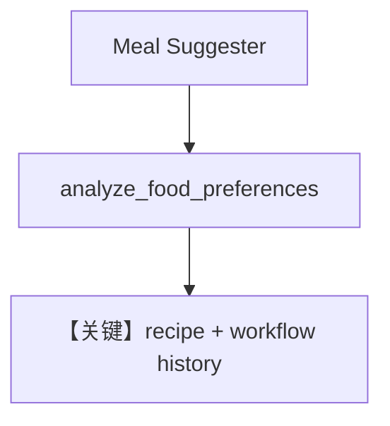

# workflow_with_history.py — 实现原理分析

> 源文件：`cookbook/05_agent_os/workflow/workflow_with_history.py`

## 概述

本示例展示 Agno 的 **工作流级历史注入**：`add_workflow_history_to_steps=True` 与 `num_history_runs=3` 使后续步可感知前几轮工作流对话；中间 `analyze_food_preferences` 为纯函数步，解析 `previous_step_content` 与当前输入中的饮食偏好。

**核心配置一览：**

| 配置项 | 值 | 说明 |
|--------|------|------|
| `meal_suggester` / `recipe_specialist` | `OpenAIChat(gpt-4o)`, 多行 `instructions` | 对话式 Agent |
| `meal_workflow` | `add_workflow_history_to_steps=True`, `num_history_runs=3` | 历史 |
| `steps` | suggestion → preference_analysis (executor) → recipe | 三步 |
| `db` | `SqliteDb(tmp/meal_workflow.db)` | 持久化 |

## 架构分层

第一步 Agent 产生建议文本；第二步函数步生成 `PREFERENCE ANALYSIS` 与 `RECIPE AGENT GUIDANCE` 块；第三步 `recipe_specialist` 结合 **工作流历史** 做食谱推荐。

## 核心组件解析

### add_workflow_history_to_steps

将工作流前序运行消息注入子步上下文（具体组装见 `agno/workflow` 消息管道），使 `recipe_specialist` 能「引用前文」。

### analyze_food_preferences

轻量 NLP 规则（关键词）提取偏好，无需 LLM。

## System Prompt 组装

`meal_suggester` 的 `instructions` 为三元素列表，内容见源码 L23–28；逐字还原：

```text
You are a friendly meal planning assistant who suggests meal categories and cuisines.
Consider the time of day, day of the week, and any context from the conversation.
Keep suggestions broad (Italian, Asian, healthy, comfort food, quick meals, etc.)
Ask follow-up questions to understand preferences better.
```

`recipe_specialist` 列表见源码 L34–40。

## 完整 API 请求

前两步后，`recipe_specialist` 的 `messages` 除 system 外包含 **历史与 guidance**，由框架注入；单次调用仍为 `chat.completions.create`。

## Mermaid 流程图



## 关键源码文件索引

| 文件 | 作用 |
|------|------|
| `agno/workflow/workflow.py` | 历史参数 |
| `agno/agent/_messages.py` | `get_system_message()` |
