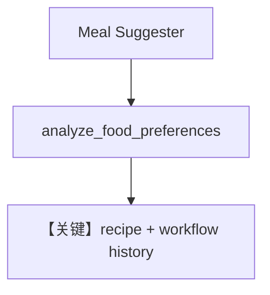

# workflow_with_history.py — 实现原理分析

<!-- cookbook-py-source:start -->
## 完整源码

```python
"""
Workflow With History
=====================

Demonstrates workflow with history.
"""

from agno.agent import Agent
from agno.db.sqlite import SqliteDb
from agno.models.openai import OpenAIChat
from agno.os import AgentOS
from agno.workflow.step import Step, StepInput, StepOutput
from agno.workflow.workflow import Workflow

# ---------------------------------------------------------------------------
# Create Example
# ---------------------------------------------------------------------------

# Define specialized agents for meal planning conversation
meal_suggester = Agent(
    name="Meal Suggester",
    model=OpenAIChat(id="gpt-4o"),
    instructions=[
        "You are a friendly meal planning assistant who suggests meal categories and cuisines.",
        "Consider the time of day, day of the week, and any context from the conversation.",
        "Keep suggestions broad (Italian, Asian, healthy, comfort food, quick meals, etc.)",
        "Ask follow-up questions to understand preferences better.",
    ],
)

recipe_specialist = Agent(
    name="Recipe Specialist",
    model=OpenAIChat(id="gpt-4o"),
    instructions=[
        "You are a recipe expert who provides specific, detailed recipe recommendations.",
        "Pay close attention to the full conversation to understand user preferences and restrictions.",
        "If the user mentioned avoiding certain foods or wanting healthier options, respect that.",
        "Provide practical, easy-to-follow recipe suggestions with ingredients and basic steps.",
        "Reference the conversation naturally (e.g., 'Since you mentioned wanting something healthier...')",
    ],
)


def analyze_food_preferences(step_input: StepInput) -> StepOutput:
    """
    Smart function that analyzes conversation history to understand user food preferences
    """
    current_request = step_input.input
    conversation_context = step_input.previous_step_content or ""

    # Simple preference analysis based on conversation
    preferences = {
        "dietary_restrictions": [],
        "cuisine_preferences": [],
        "avoid_list": [],
        "cooking_style": "any",
    }

    # Analyze conversation for patterns
    full_context = f"{conversation_context} {current_request}".lower()

    # Dietary restrictions and preferences
    if any(word in full_context for word in ["healthy", "healthier", "light", "fresh"]):
        preferences["dietary_restrictions"].append("healthy")
    if any(word in full_context for word in ["vegetarian", "veggie", "no meat"]):
        preferences["dietary_restrictions"].append("vegetarian")
    if any(word in full_context for word in ["quick", "fast", "easy", "simple"]):
        preferences["cooking_style"] = "quick"
    if any(word in full_context for word in ["comfort", "hearty", "filling"]):
        preferences["cooking_style"] = "comfort"

    # Foods/cuisines to avoid (mentioned recently)
    if "italian" in full_context and (
        "had" in full_context or "yesterday" in full_context
    ):
        preferences["avoid_list"].append("Italian")
    if "chinese" in full_context and (
        "had" in full_context or "recently" in full_context
    ):
        preferences["avoid_list"].append("Chinese")

    # Preferred cuisines mentioned positively
    if "love asian" in full_context or "like asian" in full_context:
        preferences["cuisine_preferences"].append("Asian")
    if "mediterranean" in full_context:
        preferences["cuisine_preferences"].append("Mediterranean")

    # Create guidance for the recipe agent
    guidance = []
    if preferences["dietary_restrictions"]:
        guidance.append(
            f"Focus on {', '.join(preferences['dietary_restrictions'])} options"
        )
    if preferences["avoid_list"]:
        guidance.append(
            f"Avoid {', '.join(preferences['avoid_list'])} cuisine since user had it recently"
        )
    if preferences["cuisine_preferences"]:
        guidance.append(
            f"Consider {', '.join(preferences['cuisine_preferences'])} options"
        )
    if preferences["cooking_style"] != "any":
        guidance.append(f"Prefer {preferences['cooking_style']} cooking style")

    analysis_result = f"""
        PREFERENCE ANALYSIS:
        Current Request: {current_request}

        Detected Preferences:
        {chr(10).join(f"• {g}" for g in guidance) if guidance else "• No specific preferences detected"}

        RECIPE AGENT GUIDANCE:
        Based on the conversation history, please provide recipe recommendations that align with these preferences.
        Reference the conversation naturally and explain why these recipes fit their needs.
    """.strip()

    return StepOutput(content=analysis_result)


# Define workflow steps
suggestion_step = Step(
    name="Meal Suggestion",
    agent=meal_suggester,
)

preference_analysis_step = Step(
    name="Preference Analysis",
    executor=analyze_food_preferences,
)

recipe_step = Step(
    name="Recipe Recommendations",
    agent=recipe_specialist,
)

# Create conversational meal planning workflow
meal_workflow = Workflow(
    name="Conversational Meal Planner",
    description="Smart meal planning with conversation awareness and preference learning",
    db=SqliteDb(
        session_table="workflow_session",
        db_file="tmp/meal_workflow.db",
    ),
    steps=[suggestion_step, preference_analysis_step, recipe_step],
    add_workflow_history_to_steps=True,
    num_history_runs=3,
)

agent_os = AgentOS(
    description="Example OS setup",
    workflows=[meal_workflow],
)
app = agent_os.get_app()

# ---------------------------------------------------------------------------
# Run Example
# ---------------------------------------------------------------------------

if __name__ == "__main__":
    agent_os.serve(app="workflow_with_history:app", reload=True)
```

<!-- cookbook-py-source:end -->

> 源文件：`cookbook/05_agent_os/workflow/workflow_with_history.py`

## 概述

本示例展示 Agno 的 **工作流级历史注入**：`add_workflow_history_to_steps=True` 与 `num_history_runs=3` 使后续步可感知前几轮工作流对话；中间 `analyze_food_preferences` 为纯函数步，解析 `previous_step_content` 与当前输入中的饮食偏好。

**核心配置一览：**

| 配置项 | 值 | 说明 |
|--------|------|------|
| `meal_suggester` / `recipe_specialist` | `OpenAIChat(gpt-4o)`, 多行 `instructions` | 对话式 Agent |
| `meal_workflow` | `add_workflow_history_to_steps=True`, `num_history_runs=3` | 历史 |
| `steps` | suggestion → preference_analysis (executor) → recipe | 三步 |
| `db` | `SqliteDb(tmp/meal_workflow.db)` | 持久化 |

## 架构分层

第一步 Agent 产生建议文本；第二步函数步生成 `PREFERENCE ANALYSIS` 与 `RECIPE AGENT GUIDANCE` 块；第三步 `recipe_specialist` 结合 **工作流历史** 做食谱推荐。

## 核心组件解析

### add_workflow_history_to_steps

将工作流前序运行消息注入子步上下文（具体组装见 `agno/workflow` 消息管道），使 `recipe_specialist` 能「引用前文」。

### analyze_food_preferences

轻量 NLP 规则（关键词）提取偏好，无需 LLM。

## System Prompt 组装

`meal_suggester` 的 `instructions` 为三元素列表，内容见源码 L23–28；逐字还原：

```text
You are a friendly meal planning assistant who suggests meal categories and cuisines.
Consider the time of day, day of the week, and any context from the conversation.
Keep suggestions broad (Italian, Asian, healthy, comfort food, quick meals, etc.)
Ask follow-up questions to understand preferences better.
```

`recipe_specialist` 列表见源码 L34–40。

## 完整 API 请求

前两步后，`recipe_specialist` 的 `messages` 除 system 外包含 **历史与 guidance**，由框架注入；单次调用仍为 `chat.completions.create`。

## Mermaid 流程图



## 关键源码文件索引

| 文件 | 作用 |
|------|------|
| `agno/workflow/workflow.py` | 历史参数 |
| `agno/agent/_messages.py` | `get_system_message()` |
