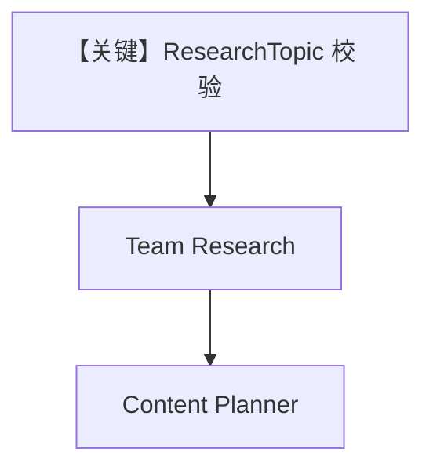

# workflow_with_input_schema.py — 实现原理分析

> 源文件：`cookbook/05_agent_os/workflow/workflow_with_input_schema.py`

## 概述

本示例展示 Agno 的 **Workflow.input_schema**：`ResearchTopic`（Pydantic）约束工作流入口字段（topic、focus_areas、target_audience、sources_required）；后续 `Team` + `Agent` 链路与 `basic_workflow_team` 类似。

**核心配置一览：**

| 配置项 | 值 | 说明 |
|--------|------|------|
| `ResearchTopic` | Pydantic 模型 | 输入校验 |
| `research_team` | `Team(model=gpt-4o-mini, ...)` | Team 显式 model |
| `content_creation_workflow` | `input_schema=ResearchTopic` | 结构化输入 |
| `db` | `SqliteDb(workflow.db)` | 持久化 |

## 架构分层

API/CLI 传入的 input 先经 schema 校验/解析，再作为 `StepInput` 流向下游。

## 核心组件解析

### input_schema

使工作流对外契约明确，便于 OpenAPI/表单生成与类型安全。

## System Prompt 组装

`research_team`：`instructions="Research tech topics from Hackernews and the web"`。

成员使用 `role` 而非长 `instructions`（hackernews_agent、web_agent）。

## 完整 API 请求

除结构化输入外，LLM 调用仍为 `OpenAIChat` → `chat.completions.create`。

## Mermaid 流程图

## 关键源码文件索引

| 文件 | 作用 |
|------|------|
| `agno/workflow/workflow.py` | `input_schema` |
| `agno/team/_messages.py` | Team system |
