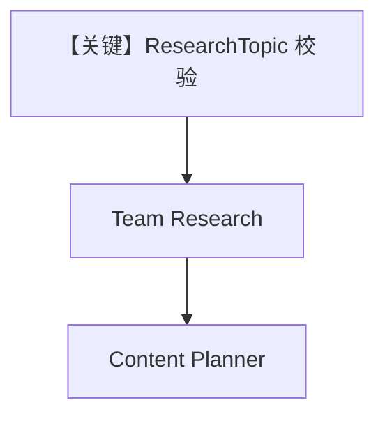

# workflow_with_input_schema.py — 实现原理分析

<!-- cookbook-py-source:start -->
## 完整源码

```python
"""
Workflow With Input Schema
==========================

Demonstrates workflow with input schema.
"""

from typing import List

from agno.agent.agent import Agent

# ---------------------------------------------------------------------------
# Create Example
# ---------------------------------------------------------------------------
# Import the workflows
from agno.db.sqlite import SqliteDb
from agno.models.openai.chat import OpenAIChat
from agno.os import AgentOS
from agno.team.team import Team
from agno.tools.hackernews import HackerNewsTools
from agno.tools.websearch import WebSearchTools
from agno.workflow.step import Step
from agno.workflow.workflow import Workflow
from pydantic import BaseModel, Field


class ResearchTopic(BaseModel):
    """Structured research topic with specific requirements"""

    topic: str
    focus_areas: List[str] = Field(description="Specific areas to focus on")
    target_audience: str = Field(description="Who this research is for")
    sources_required: int = Field(description="Number of sources needed", default=5)


# Define agents
hackernews_agent = Agent(
    name="Hackernews Agent",
    model=OpenAIChat(id="gpt-4o-mini"),
    tools=[HackerNewsTools()],
    role="Extract key insights and content from Hackernews posts",
)
web_agent = Agent(
    name="Web Agent",
    model=OpenAIChat(id="gpt-4o-mini"),
    tools=[WebSearchTools()],
    role="Search the web for the latest news and trends",
)

# Define research team for complex analysis
research_team = Team(
    name="Research Team",
    model=OpenAIChat(id="gpt-4o-mini"),
    members=[hackernews_agent, web_agent],
    instructions="Research tech topics from Hackernews and the web",
)

content_planner = Agent(
    name="Content Planner",
    model=OpenAIChat(id="gpt-4o"),
    instructions=[
        "Plan a content schedule over 4 weeks for the provided topic and research content",
        "Ensure that I have posts for 3 posts per week",
    ],
)

# Define steps
research_step = Step(
    name="Research Step",
    team=research_team,
)

content_planning_step = Step(
    name="Content Planning Step",
    agent=content_planner,
)

content_creation_workflow = Workflow(
    name="Content Creation Workflow",
    description="Automated content creation from blog posts to social media",
    db=SqliteDb(
        session_table="workflow_session",
        db_file="tmp/workflow.db",
    ),
    steps=[research_step, content_planning_step],
    input_schema=ResearchTopic,
)

# Initialize the AgentOS with the workflows
agent_os = AgentOS(
    description="Example OS setup",
    workflows=[content_creation_workflow],
)
app = agent_os.get_app()

# ---------------------------------------------------------------------------
# Run Example
# ---------------------------------------------------------------------------

if __name__ == "__main__":
    agent_os.serve(app="workflow_with_input_schema:app", reload=True)
```

<!-- cookbook-py-source:end -->

> 源文件：`cookbook/05_agent_os/workflow/workflow_with_input_schema.py`

## 概述

本示例展示 Agno 的 **Workflow.input_schema**：`ResearchTopic`（Pydantic）约束工作流入口字段（topic、focus_areas、target_audience、sources_required）；后续 `Team` + `Agent` 链路与 `basic_workflow_team` 类似。

**核心配置一览：**

| 配置项 | 值 | 说明 |
|--------|------|------|
| `ResearchTopic` | Pydantic 模型 | 输入校验 |
| `research_team` | `Team(model=gpt-4o-mini, ...)` | Team 显式 model |
| `content_creation_workflow` | `input_schema=ResearchTopic` | 结构化输入 |
| `db` | `SqliteDb(workflow.db)` | 持久化 |

## 架构分层

API/CLI 传入的 input 先经 schema 校验/解析，再作为 `StepInput` 流向下游。

## 核心组件解析

### input_schema

使工作流对外契约明确，便于 OpenAPI/表单生成与类型安全。

## System Prompt 组装

`research_team`：`instructions="Research tech topics from Hackernews and the web"`。

成员使用 `role` 而非长 `instructions`（hackernews_agent、web_agent）。

## 完整 API 请求

除结构化输入外，LLM 调用仍为 `OpenAIChat` → `chat.completions.create`。

## Mermaid 流程图



## 关键源码文件索引

| 文件 | 作用 |
|------|------|
| `agno/workflow/workflow.py` | `input_schema` |
| `agno/team/_messages.py` | Team system |
