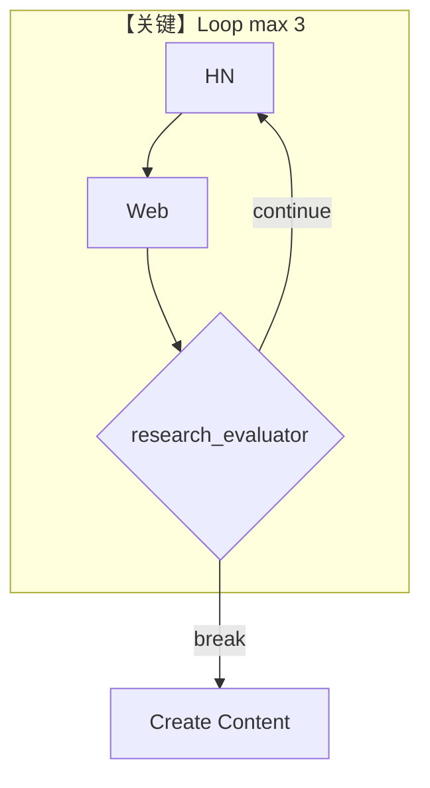

# workflow_with_loop.py — 实现原理分析

> 源文件：`cookbook/05_agent_os/workflow/workflow_with_loop.py`

## 概述

本示例展示 Agno 的 **Loop 子图**：`Loop(steps=[hn_step, web_step], end_condition=research_evaluator, max_iterations=3)` 在研究充分前重复两子步；之后进入 `content_step`。

**核心配置一览：**

| 配置项 | 值 | 说明 |
|--------|------|------|
| `research_agent` | `gpt-4o-mini`, 双工具, `markdown=True` | 循环内共用 |
| `Loop` | `max_iterations=3` | 上限 |
| `research_evaluator` | 输出长度 >200 则结束 | 结束条件 |

## 架构分层

`Loop` 引擎反复执行子 `Step` 直至 `end_condition(outputs)` 为 True 或达最大迭代。

## 核心组件解析

### research_evaluator

读 `List[StepOutput]`，任一内容长度超阈值即 **跳出循环**。

## System Prompt 组装

`research_agent`：

```text
You are a research specialist. Research the given topic thoroughly.
```

（`markdown=True` 附加 `# 3.2.1`。）

## 完整 API 请求

循环内多次 `chat.completions.create`；迭代次数影响总费用。

## Mermaid 流程图



## 关键源码文件索引

| 文件 | 作用 |
|------|------|
| `agno/workflow/loop.py` | `Loop` |
