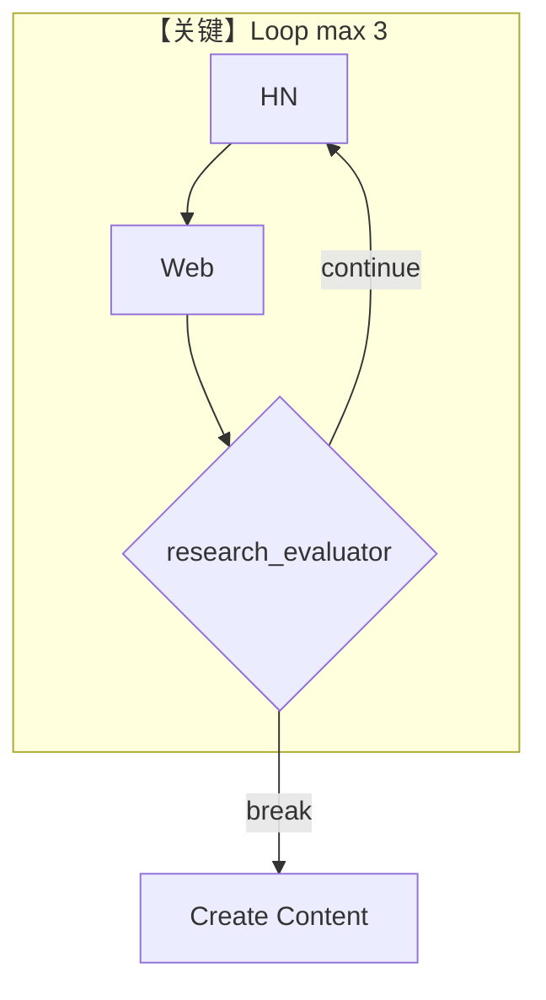

# workflow_with_loop.py — 实现原理分析

<!-- cookbook-py-source:start -->
## 完整源码

```python
"""
Workflow With Loop
==================

Demonstrates workflow with loop.
"""

from typing import List

from agno.agent.agent import Agent
from agno.db.sqlite import SqliteDb
from agno.models.openai.chat import OpenAIChat

# ---------------------------------------------------------------------------
# Create Example
# ---------------------------------------------------------------------------
# Import the workflows
from agno.os import AgentOS
from agno.tools.hackernews import HackerNewsTools
from agno.tools.websearch import WebSearchTools
from agno.workflow.loop import Loop
from agno.workflow.step import Step
from agno.workflow.types import StepOutput
from agno.workflow.workflow import Workflow

research_agent = Agent(
    name="Research Agent",
    role="Research specialist",
    model=OpenAIChat(id="gpt-4o-mini"),
    tools=[HackerNewsTools(), WebSearchTools()],
    instructions="You are a research specialist. Research the given topic thoroughly.",
    markdown=True,
)

content_agent = Agent(
    name="Content Agent",
    model=OpenAIChat(id="gpt-4o-mini"),
    role="Content creator",
    instructions="You are a content creator. Create engaging content based on research.",
    markdown=True,
)

# Create research steps
research_hackernews_step = Step(
    name="Research HackerNews",
    agent=research_agent,
    description="Research trending topics on HackerNews",
)

research_web_step = Step(
    name="Research Web",
    agent=research_agent,
    description="Research additional information from web sources",
)

content_step = Step(
    name="Create Content",
    agent=content_agent,
    description="Create content based on research findings",
)

# End condition function


def research_evaluator(outputs: List[StepOutput]) -> bool:
    """
    Evaluate if research results are sufficient
    Returns True to break the loop, False to continue
    """
    # Check if we have good research results
    if not outputs:
        return False

    # Simple check - if any output contains substantial content, we're good
    for output in outputs:
        if output.content and len(output.content) > 200:
            print(
                f"✅ Research evaluation passed - found substantial content ({len(output.content)} chars)"
            )
            return True

    print("❌ Research evaluation failed - need more substantial research")
    return False


# Create workflow with loop
workflow = Workflow(
    name="research-and-content-workflow",
    description="Research topics in a loop until conditions are met, then create content",
    steps=[
        Loop(
            name="Research Loop",
            steps=[research_hackernews_step, research_web_step],
            end_condition=research_evaluator,
            max_iterations=3,  # Maximum 3 iterations
        ),
        content_step,
    ],
    db=SqliteDb(
        session_table="workflow_session",
        db_file="tmp/workflow.db",
    ),
)

# Initialize the AgentOS with the workflows
agent_os = AgentOS(
    description="Example OS setup",
    workflows=[workflow],
)
app = agent_os.get_app()

# ---------------------------------------------------------------------------
# Run Example
# ---------------------------------------------------------------------------

if __name__ == "__main__":
    agent_os.serve(app="workflow_with_loop:app", reload=True)
```

<!-- cookbook-py-source:end -->

> 源文件：`cookbook/05_agent_os/workflow/workflow_with_loop.py`

## 概述

本示例展示 Agno 的 **Loop 子图**：`Loop(steps=[hn_step, web_step], end_condition=research_evaluator, max_iterations=3)` 在研究充分前重复两子步；之后进入 `content_step`。

**核心配置一览：**

| 配置项 | 值 | 说明 |
|--------|------|------|
| `research_agent` | `gpt-4o-mini`, 双工具, `markdown=True` | 循环内共用 |
| `Loop` | `max_iterations=3` | 上限 |
| `research_evaluator` | 输出长度 >200 则结束 | 结束条件 |

## 架构分层

`Loop` 引擎反复执行子 `Step` 直至 `end_condition(outputs)` 为 True 或达最大迭代。

## 核心组件解析

### research_evaluator

读 `List[StepOutput]`，任一内容长度超阈值即 **跳出循环**。

## System Prompt 组装

`research_agent`：

```text
You are a research specialist. Research the given topic thoroughly.
```

（`markdown=True` 附加 `# 3.2.1`。）

## 完整 API 请求

循环内多次 `chat.completions.create`；迭代次数影响总费用。

## Mermaid 流程图



## 关键源码文件索引

| 文件 | 作用 |
|------|------|
| `agno/workflow/loop.py` | `Loop` |
