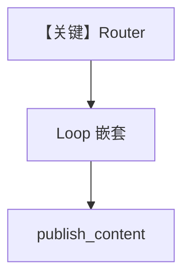

# workflow_with_nested_steps.py — 实现原理分析

> 源文件：`cookbook/05_agent_os/workflow/workflow_with_nested_steps.py`

## 概述

本示例展示 Agno 的 **Router + 嵌套 Loop**：`Router` 的 `selector` 当前实现 **恒返回** `deep_tech_research_loop`（仅含 HN 子步的循环）→ 再接 `publish_content`；演示「路由目标可以是复合 Step」。

**核心配置一览：**

| 配置项 | 值 | 说明 |
|--------|------|------|
| `deep_tech_research_loop` | `Loop([research_hackernews], end_condition=research_quality_check, max_iterations=3)` | 嵌套 |
| `Router` | `choices=[research_web, deep_tech_research_loop]` | 动态选路 |
| `db` | `PostgresDb` | 持久化 |
| Agent | 多数无显式 model | 运行前需补全 |

## 架构分层

`Router` 先执行，选中 `List[Step]` 展开；嵌套 `Loop` 内部仍走标准 Agent 运行。

## 核心组件解析

### research_strategy_router

当前源码 **固定** `return [deep_tech_research_loop]`，未使用 `research_web`，便于读者聚焦嵌套结构（可改为按 topic 分支）。

## System Prompt 组装

示例 `hackernews_agent.instructions` 为长单字符串，完整见源码 L27–31；此处不重复。

## 完整 API 请求

依赖各 Agent 配置的 `Model`；未设置时需补全。

## Mermaid 流程图

## 关键源码文件索引

| 文件 | 作用 |
|------|------|
| `agno/workflow/router.py` | `Router` |
| `agno/workflow/loop.py` | `Loop` |
