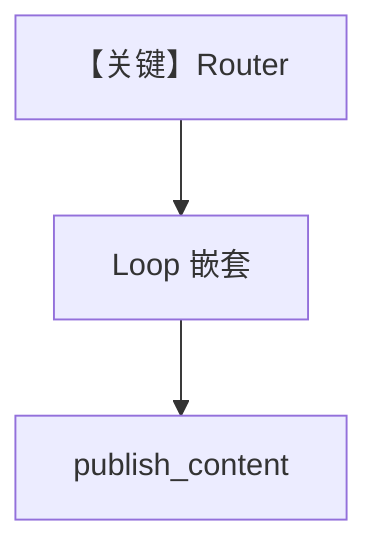

# workflow_with_nested_steps.py — 实现原理分析

<!-- cookbook-py-source:start -->
## 完整源码

```python
"""
Workflow With Nested Steps
==========================

Demonstrates workflow with nested steps.
"""

from typing import List

from agno.agent.agent import Agent
from agno.db.postgres import PostgresDb

# ---------------------------------------------------------------------------
# Create Example
# ---------------------------------------------------------------------------
# Import the workflows
from agno.os import AgentOS
from agno.tools.hackernews import HackerNewsTools
from agno.tools.websearch import WebSearchTools
from agno.workflow.loop import Loop
from agno.workflow.router import Router
from agno.workflow.step import Step
from agno.workflow.types import StepInput, StepOutput
from agno.workflow.workflow import Workflow

# Define the research agents
hackernews_agent = Agent(
    name="HackerNews Researcher",
    instructions="You are a researcher specializing in finding the latest tech news and discussions from Hacker News. Focus on startup trends, programming topics, and tech industry insights.",
    tools=[HackerNewsTools()],
)

web_agent = Agent(
    name="Web Researcher",
    instructions="You are a comprehensive web researcher. Search across multiple sources including news sites, blogs, and official documentation to gather detailed information.",
    tools=[WebSearchTools()],
)

content_agent = Agent(
    name="Content Publisher",
    instructions="You are a content creator who takes research data and creates engaging, well-structured articles. Format the content with proper headings, bullet points, and clear conclusions.",
)

# Create the research steps
research_hackernews = Step(
    name="research_hackernews",
    agent=hackernews_agent,
    description="Research latest tech trends from Hacker News",
)

research_web = Step(
    name="research_web",
    agent=web_agent,
    description="Comprehensive web research on the topic",
)

publish_content = Step(
    name="publish_content",
    agent=content_agent,
    description="Create and format final content for publication",
)

# End condition function for the loop


def research_quality_check(outputs: List[StepOutput]) -> bool:
    """
    Evaluate if research results are sufficient
    Returns True to break the loop, False to continue
    """
    if not outputs:
        return False

    # Check if any output contains substantial content
    for output in outputs:
        if output.content and len(output.content) > 300:
            print(
                f"[OK] Research quality check passed - found substantial content ({len(output.content)} chars)"
            )
            return True

    print("[FAIL] Research quality check failed - need more substantial research")
    return False


# Create a Loop step for deep tech research
deep_tech_research_loop = Loop(
    name="Deep Tech Research Loop",
    steps=[research_hackernews],
    end_condition=research_quality_check,
    max_iterations=3,
    description="Perform iterative deep research on tech topics",
)

# Router function that selects between simple web research or deep tech research loop


def research_strategy_router(step_input: StepInput) -> List[Step]:
    """
    Decide between simple web research or deep tech research loop based on the input topic.
    Returns either a single web research step or a tech research loop.
    """
    return [deep_tech_research_loop]


workflow = Workflow(
    name="Adaptive Research Workflow",
    description="Intelligently selects between simple web research or deep iterative tech research based on topic complexity",
    steps=[
        Router(
            name="research_strategy_router",
            selector=research_strategy_router,
            choices=[research_web, deep_tech_research_loop],
            description="Chooses between simple web research or deep tech research loop",
        ),
        publish_content,
    ],
    db=PostgresDb(
        db_url="postgresql+psycopg://ai:ai@localhost:5532/ai",
    ),
)

# Initialize the AgentOS with the workflows
agent_os = AgentOS(
    description="Example OS setup",
    workflows=[workflow],
)
app = agent_os.get_app()

# ---------------------------------------------------------------------------
# Run Example
# ---------------------------------------------------------------------------

if __name__ == "__main__":
    agent_os.serve(app="workflow_with_nested_steps:app", reload=True)
```

<!-- cookbook-py-source:end -->

> 源文件：`cookbook/05_agent_os/workflow/workflow_with_nested_steps.py`

## 概述

本示例展示 Agno 的 **Router + 嵌套 Loop**：`Router` 的 `selector` 当前实现 **恒返回** `deep_tech_research_loop`（仅含 HN 子步的循环）→ 再接 `publish_content`；演示「路由目标可以是复合 Step」。

**核心配置一览：**

| 配置项 | 值 | 说明 |
|--------|------|------|
| `deep_tech_research_loop` | `Loop([research_hackernews], end_condition=research_quality_check, max_iterations=3)` | 嵌套 |
| `Router` | `choices=[research_web, deep_tech_research_loop]` | 动态选路 |
| `db` | `PostgresDb` | 持久化 |
| Agent | 多数无显式 model | 运行前需补全 |

## 架构分层

`Router` 先执行，选中 `List[Step]` 展开；嵌套 `Loop` 内部仍走标准 Agent 运行。

## 核心组件解析

### research_strategy_router

当前源码 **固定** `return [deep_tech_research_loop]`，未使用 `research_web`，便于读者聚焦嵌套结构（可改为按 topic 分支）。

## System Prompt 组装

示例 `hackernews_agent.instructions` 为长单字符串，完整见源码 L27–31；此处不重复。

## 完整 API 请求

依赖各 Agent 配置的 `Model`；未设置时需补全。

## Mermaid 流程图



## 关键源码文件索引

| 文件 | 作用 |
|------|------|
| `agno/workflow/router.py` | `Router` |
| `agno/workflow/loop.py` | `Loop` |
