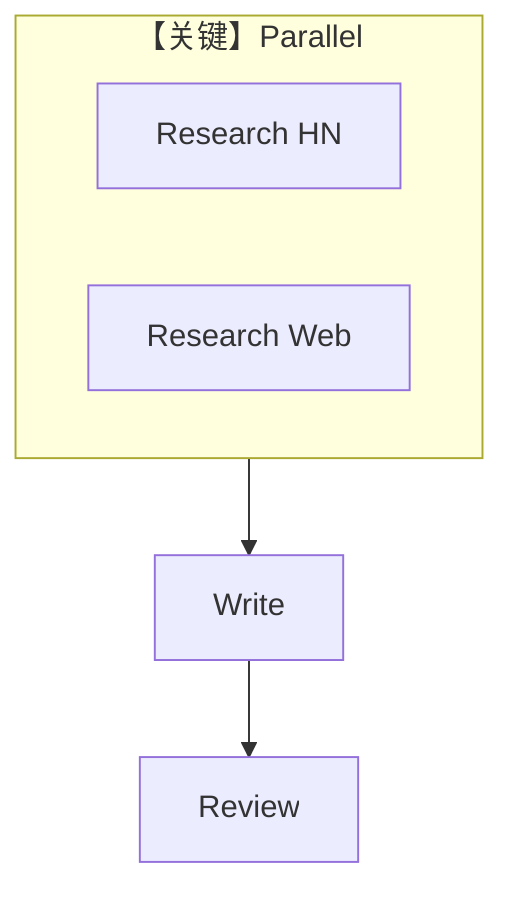

# workflow_with_parallel.py — 实现原理分析

> 源文件：`cookbook/05_agent_os/workflow/workflow_with_parallel.md`

## 概述

本示例展示 Agno 的 **Parallel 同步并行**：`Parallel(research_hn_step, research_web_step)` 共享同一 `researcher` Agent，两子步并行；随后 `write` → `review`。

**核心配置一览：**

| 配置项 | 值 | 说明 |
|--------|------|------|
| `researcher` | `HackerNewsTools`+`WebSearchTools` | 并行两步共用 |
| `writer` / `reviewer` | 无 tools、**无 model** | 需环境或后续补全 |
| `Parallel` | 命名 `"Research Phase"` | 并行相 |

## 架构分层

`Parallel` 引擎并发执行子 Step，再合并输出供后续步使用（合并策略见框架实现）。

## 核心组件解析

### 无 model Agent

`writer`/`reviewer` 未指定 `model`，实际运行前须设置，否则 `get_system_message` 可能失败。

## System Prompt 组装

`researcher` 无 `instructions`，无 `role`，则 system 可能仅含工具说明等默认段（若 `build_context` 为真）；建议为 Agent 显式添加 `instructions` 或 `role`。

## 完整 API 请求

配置好 model 后：`chat.completions.create`。

## Mermaid 流程图

## 关键源码文件索引

| 文件 | 作用 |
|------|------|
| `agno/workflow/parallel.py` | `Parallel` |
