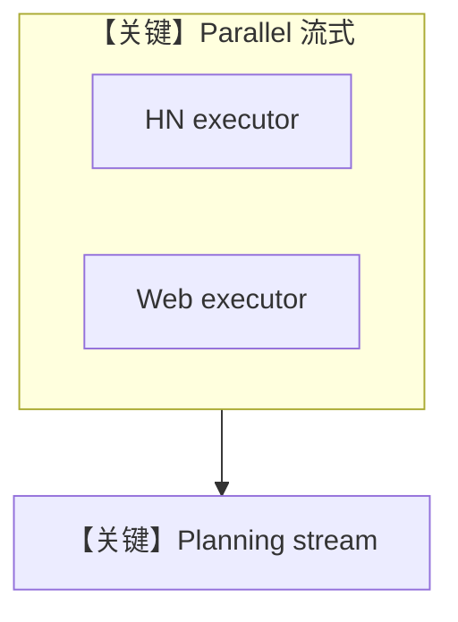

# workflow_with_parallel_and_custom_function_step_stream.py — 实现原理分析

> 源文件：`cookbook/05_agent_os/workflow/workflow_with_parallel_and_custom_function_step_stream.py`

## 概述

本示例展示 Agno 的 **Parallel + 流式自定义 executor**：两路 `hackernews_research_function` / `web_search_research_function` 内对子 Agent `arun(..., stream=True, stream_events=True)` 并 `yield` 事件；合并后再由 `custom_content_planning_function` 流式规划。

**核心配置一览：**

| 配置项 | 值 | 说明 |
|--------|------|------|
| 子 Agent | `InMemoryDb()` 隔离 | 轻量 |
| `Parallel` | 两自定义 Step | 并行研究 |
| `steps` | Parallel → planning | 先并行后汇总 |
| `db` | `SqliteDb(streaming_workflow_session)` | 工作流会话 |

## 架构分层

与 `workflow_with_custom_function` 类似，但 **并行放大吞吐**，且全程 **异步流式**。

## 核心组件解析

三处 `AsyncIterator` executor 均遵循：流式消费子 Agent → 包装为 `StepOutput`。

## System Prompt 组装

子 Agent 的静态 `instructions` 见源码；**用户消息**主要来自各 `research_prompt` / `planning_prompt` f-string。

## 完整 API 请求

`arun` 路径走异步与流式 API；最终仍对应 OpenAI 流式 completions（见 `chat.py` stream 方法）。

## Mermaid 流程图

## 关键源码文件索引

| 文件 | 作用 |
|------|------|
| `agno/workflow/parallel.py` | `Parallel` |
| `agno/agent/agent.py` | `arun`, `get_last_run_output` |
