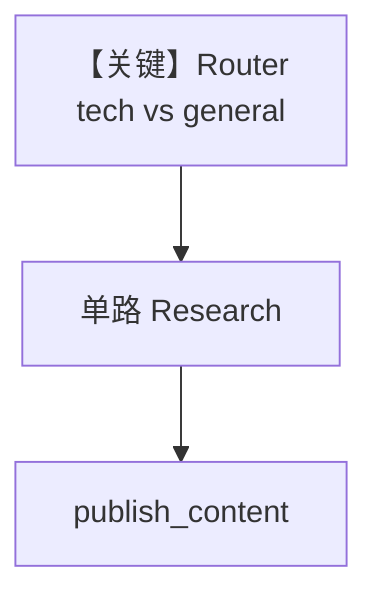

# workflow_with_router.py — 实现原理分析

> 源文件：`cookbook/05_agent_os/workflow/workflow_with_router.py`

## 概述

本示例展示 Agno 的 **Router 按主题选研究路径**：`research_router` 检测关键词是否在 `tech_keywords` 中，返回 `[research_hackernews]` 或 `[research_web]`；随后统一 `publish_content`。

**核心配置一览：**

| 配置项 | 值 | 说明 |
|--------|------|------|
| `Router` | `selector=research_router`, `choices=[...]` | 动态步骤列表 |
| Agent | 无显式 model | 需补全 |
| `db` | `SqliteDb` | 持久化 |

## 架构分层

`Router` 输出 `List[Step]`，由工作流引擎调度；选中单步执行后再进入下一步。

## 核心组件解析

### research_router

`topic` 取自 `previous_step_content or step_input.input`，支持首轮用用户原始输入。

## System Prompt 组装

`hackernews_agent.instructions` 为长字符串（源码 L27–29）；`web_agent`（L33–35）；`content_agent`（L39–41）。逐字还原请对照 `.py`。

## 完整 API 请求

配置 model 后标准 Chat Completions。

## Mermaid 流程图

## 关键源码文件索引

| 文件 | 作用 |
|------|------|
| `agno/workflow/router.py` | `Router` |
