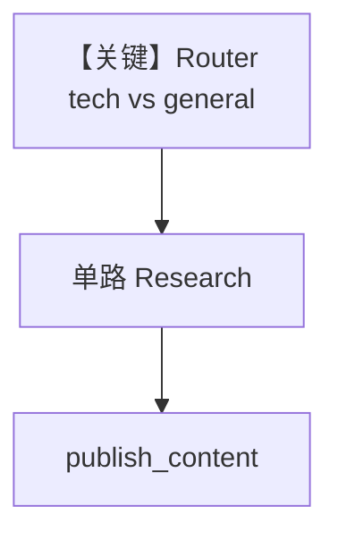

# workflow_with_router.py — 实现原理分析

<!-- cookbook-py-source:start -->
## 完整源码

```python
"""
Workflow With Router
====================

Demonstrates workflow with router.
"""

from typing import List

from agno.agent.agent import Agent
from agno.db.sqlite import SqliteDb

# ---------------------------------------------------------------------------
# Create Example
# ---------------------------------------------------------------------------
# Import the workflows
from agno.os import AgentOS
from agno.tools.hackernews import HackerNewsTools
from agno.tools.websearch import WebSearchTools
from agno.workflow.router import Router
from agno.workflow.step import Step
from agno.workflow.types import StepInput
from agno.workflow.workflow import Workflow

# Define the research agents
hackernews_agent = Agent(
    name="HackerNews Researcher",
    instructions="You are a researcher specializing in finding the latest tech news and discussions from Hacker News. Focus on startup trends, programming topics, and tech industry insights.",
    tools=[HackerNewsTools()],
)

web_agent = Agent(
    name="Web Researcher",
    instructions="You are a comprehensive web researcher. Search across multiple sources including news sites, blogs, and official documentation to gather detailed information.",
    tools=[WebSearchTools()],
)

content_agent = Agent(
    name="Content Publisher",
    instructions="You are a content creator who takes research data and creates engaging, well-structured articles. Format the content with proper headings, bullet points, and clear conclusions.",
)

# Create the research steps
research_hackernews = Step(
    name="research_hackernews",
    agent=hackernews_agent,
    description="Research latest tech trends from Hacker News",
)

research_web = Step(
    name="research_web",
    agent=web_agent,
    description="Comprehensive web research on the topic",
)

publish_content = Step(
    name="publish_content",
    agent=content_agent,
    description="Create and format final content for publication",
)


# Now returns Step(s) to execute
def research_router(step_input: StepInput) -> List[Step]:
    """
    Decide which research method to use based on the input topic.
    Returns a list containing the step(s) to execute.
    """
    # Use the original workflow message if this is the first step
    topic = step_input.previous_step_content or step_input.input or ""
    topic = topic.lower()

    # Check if the topic is tech/startup related - use HackerNews
    tech_keywords = [
        "startup",
        "programming",
        "ai",
        "machine learning",
        "software",
        "developer",
        "coding",
        "tech",
        "silicon valley",
        "venture capital",
        "cryptocurrency",
        "blockchain",
        "open source",
        "github",
    ]

    if any(keyword in topic for keyword in tech_keywords):
        print(f"Tech topic detected: Using HackerNews research for '{topic}'")
        return [research_hackernews]
    else:
        print(f"General topic detected: Using web research for '{topic}'")
        return [research_web]


workflow = Workflow(
    name="intelligent-research-workflow",
    description="Automatically selects the best research method based on topic, then publishes content",
    steps=[
        Router(
            name="research_strategy_router",
            selector=research_router,
            choices=[research_hackernews, research_web],
            description="Intelligently selects research method based on topic",
        ),
        publish_content,
    ],
    db=SqliteDb(
        session_table="workflow_session",
        db_file="tmp/workflow.db",
    ),
)

# Initialize the AgentOS with the workflows
agent_os = AgentOS(
    description="Example OS setup",
    workflows=[workflow],
)
app = agent_os.get_app()

# ---------------------------------------------------------------------------
# Run Example
# ---------------------------------------------------------------------------

if __name__ == "__main__":
    agent_os.serve(app="workflow_with_router:app", reload=True)
```

<!-- cookbook-py-source:end -->

> 源文件：`cookbook/05_agent_os/workflow/workflow_with_router.py`

## 概述

本示例展示 Agno 的 **Router 按主题选研究路径**：`research_router` 检测关键词是否在 `tech_keywords` 中，返回 `[research_hackernews]` 或 `[research_web]`；随后统一 `publish_content`。

**核心配置一览：**

| 配置项 | 值 | 说明 |
|--------|------|------|
| `Router` | `selector=research_router`, `choices=[...]` | 动态步骤列表 |
| Agent | 无显式 model | 需补全 |
| `db` | `SqliteDb` | 持久化 |

## 架构分层

`Router` 输出 `List[Step]`，由工作流引擎调度；选中单步执行后再进入下一步。

## 核心组件解析

### research_router

`topic` 取自 `previous_step_content or step_input.input`，支持首轮用用户原始输入。

## System Prompt 组装

`hackernews_agent.instructions` 为长字符串（源码 L27–29）；`web_agent`（L33–35）；`content_agent`（L39–41）。逐字还原请对照 `.py`。

## 完整 API 请求

配置 model 后标准 Chat Completions。

## Mermaid 流程图



## 关键源码文件索引

| 文件 | 作用 |
|------|------|
| `agno/workflow/router.py` | `Router` |
