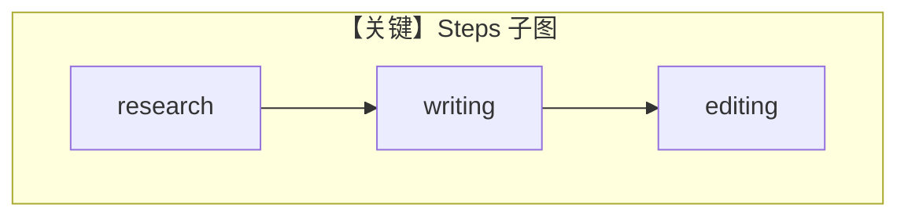

# workflow_with_steps.py — 实现原理分析

> 源文件：`cookbook/05_agent_os/workflow/workflow_with_steps.py`

## 概述

本示例展示 Agno 的 **`Steps` 组合子**：`Steps(name="article_creation", steps=[research, writing, editing])` 作为 **单个子图** 放入 `Workflow.steps`，等价于顺序链的语法糖。

**核心配置一览：**

| 配置项 | 值 | 说明 |
|--------|------|------|
| `researcher` | `gpt-4o-mini`, `WebSearchTools` | 研究 |
| `writer` | `gpt-4o` | 写作 |
| `editor` | `gpt-4o` | 编辑 |
| `article_creation_sequence` | `Steps([...])` | 三步封装 |
| `article_workflow` | `steps=[article_creation_sequence]` | 外层 Workflow 单步为 Steps |

## 架构分层

外层只看到一步 `Steps`；内部仍顺序执行三个 `Step`。

## 核心组件解析

### Steps vs 扁平 steps

便于复用「文章生产线」子模块，插入其他工作流时作为黑盒。

## System Prompt 组装

`researcher`：

```text
Research the given topic and provide key facts and insights.
```

`writer` / `editor` 见源码 L30–39。

## 完整 API 请求

三步各一次 `chat.completions.create`，模型 id 不同。

## Mermaid 流程图



## 关键源码文件索引

| 文件 | 作用 |
|------|------|
| `agno/workflow/steps.py` | `Steps` |
