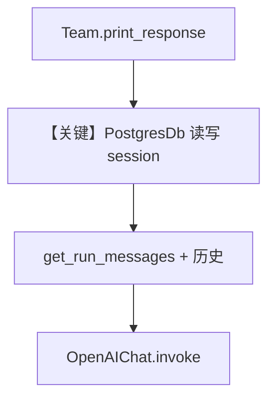

# 01_persistent_session_storage.py — 实现原理分析

<!-- cookbook-py-source:start -->
## 完整源码

```python
"""
Persistent Session Storage
==========================

Demonstrates using PostgresDb for persistent session storage with a team.
"""

from agno.agent.agent import Agent
from agno.db.postgres import PostgresDb
from agno.models.openai import OpenAIChat
from agno.team.team import Team

# ---------------------------------------------------------------------------
# Setup
# ---------------------------------------------------------------------------
db_url = "postgresql+psycopg://ai:ai@localhost:5532/ai"
db = PostgresDb(db_url=db_url, session_table="sessions")

# ---------------------------------------------------------------------------
# Create Team
# ---------------------------------------------------------------------------
agent = Agent(name="test_agent", model=OpenAIChat(id="gpt-5.2"))
team = Team(
    members=[agent],
    db=db,
    session_id="team_session_storage",
    add_history_to_context=True,
)

# ---------------------------------------------------------------------------
# Run Team
# ---------------------------------------------------------------------------
if __name__ == "__main__":
    team.print_response("Tell me a new interesting fact about space")
```

<!-- cookbook-py-source:end -->

> 源文件：`cookbook/06_storage/01_persistent_session_storage.py`

## 概述

本示例展示 Agno 的 **PostgresDb 持久化 Team 会话**：`PostgresDb(session_table="sessions")` 存会话；`Team` 设置 `session_id` 与 `add_history_to_context=True`，使多轮 `print_response` 可恢复上下文。

**核心配置一览：**

| 配置项 | 值 | 说明 |
|--------|------|------|
| `db` | `PostgresDb(db_url, session_table="sessions")` | 会话表名 |
| `agent` | `name="test_agent"`, `model=OpenAIChat(gpt-5.2)` | 成员 |
| `team` | `members=[agent]`, `db=db`, `session_id="team_session_storage"`, `add_history_to_context=True` | 持久会话键 |
| `instructions` | 未设置 | 未设置 |
| `description` | 未设置 | 未设置 |

## 架构分层

```
Team.print_response → run → get_run_messages（add_history_to_context=True 时合并历史，_messages.py 约 L1618+）→ Model
                                ↓
                         PostgresDb 读写 session
```

## 核心组件解析

### 持久会话

`session_id` 与 `db` 共同定位存储行；跨进程重启后同一 `session_id` 可继续对话（数据仍在 Postgres）。

### 运行机制与因果链

1. **路径**：用户消息 → Team 编排 → 成员 Agent → LLM。
2. **副作用**：Postgres 追加 run/messages。
3. **定位**：**生产级会话存储** 的最小 Team 示例。

## System Prompt 组装

`Agent` 无 `instructions`/`description`；Team 无 `instructions`。默认 system 仅含模型附加段等（若 `build_context` 为真）。若需固定角色请显式设置 `instructions`。

### 还原后的完整 System 文本

无法仅从本文件静态还原长正文；默认拼装见 `get_system_message()`（`agno/agent/_messages.py` L106+）。可用断点打印 `Message.content` 验证。

## 完整 API 请求

`OpenAIChat` → `chat.completions.create`（`agno/models/openai/chat.py` L412+）；历史消息来自 `get_run_messages` 在 `add_history_to_context=True` 时注入（`agno/agent/_messages.py` 约 L1618+ 分支）。

## Mermaid 流程图



## 关键源码文件索引

| 文件 | 关键函数/类 | 作用 |
|------|------------|------|
| `agno/db/postgres.py` | `PostgresDb` | 持久化 |
| `agno/agent/_messages.py` | `get_run_messages()` 约 L1585+ | 历史注入 |
| `agno/team/team.py` | `Team.run` / `print_response` | 编排 |
