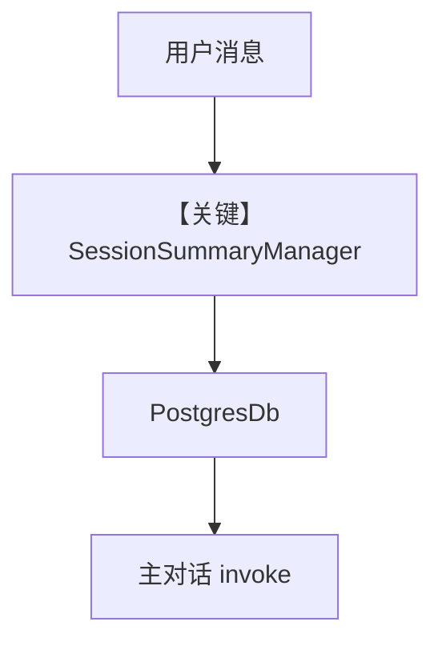

# 02_session_summary.py — 实现原理分析

> 源文件：`cookbook/06_storage/02_session_summary.py`

## 概述

本示例展示 Agno 的 **SessionSummaryManager + PostgresDb**：通过 `session_summary_manager=SessionSummaryManager(model=OpenAIChat(gpt-5.2))` 让框架在会话维度生成摘要（与注释中 `enable_session_summaries` 方案二选一）；`session_id` 固定便于复现。

**核心配置一览：**

| 配置项 | 值 | 说明 |
|--------|------|------|
| `db` | `PostgresDb(..., session_table="sessions")` | 存储 |
| `agent` | `model=gpt-5.2`, `db`, `session_id="session_summary"`, `session_summary_manager=...` | 摘要管理器 |
| `enable_session_summaries` | 未使用（注释为另一路径） | 未设置 |

## 架构分层

会话摘要由 `SessionSummaryManager` 触发额外模型调用，摘要文本再进入后续 run 的上下文（具体挂钩见 `agno/session/summary.py` 与 `get_run_messages` 中的摘要段）。

## 核心组件解析

### 运行机制与因果链

1. **路径**：首轮用户自我介绍 → 次轮偏好 → 摘要模型压缩历史。
2. **副作用**：Postgres 存 runs；摘要存于 session 记录或关联表（依实现）。
3. **定位**：**长对话压缩** 与持久化结合。

## System Prompt 组装

本 Agent **未设** `instructions`/`description`；摘要相关提示由 `SessionSummaryManager` 内部模板提供（需读 `agno/session/summary.py`）。

### 还原后的完整 System 文本

默认 Agent system 可能极短；摘要 **非** `get_system_message` 静态段。请运行时打印或阅读 `SessionSummaryManager` 源码。

## 完整 API 请求

除对话 `chat.completions.create` 外，摘要步骤会额外调用同一 `gpt-5.2`（见 `SessionSummaryManager` 构造）。

## Mermaid 流程图

## 关键源码文件索引

| 文件 | 作用 |
|------|------|
| `agno/session/summary.py` | `SessionSummaryManager` |
| `agno/agent/_messages.py` | `get_run_messages` |
