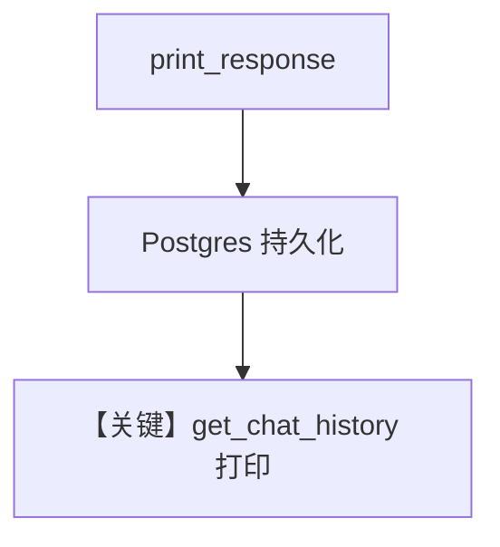

# 03_chat_history.py — 实现原理分析

<!-- cookbook-py-source:start -->
## 完整源码

```python
"""
Chat History
============

Demonstrates retrieving chat history from agent sessions stored in PostgresDb.
"""

from agno.agent.agent import Agent
from agno.db.postgres import PostgresDb
from agno.models.openai import OpenAIChat

# ---------------------------------------------------------------------------
# Setup
# ---------------------------------------------------------------------------
db_url = "postgresql+psycopg://ai:ai@localhost:5532/ai"
db = PostgresDb(db_url=db_url, session_table="sessions")

# ---------------------------------------------------------------------------
# Create Agent
# ---------------------------------------------------------------------------
agent = Agent(
    model=OpenAIChat(id="gpt-5.2"),
    db=db,
    session_id="chat_history",
    instructions="You are a helpful assistant that can answer questions about space and oceans.",
    add_history_to_context=True,
)

# ---------------------------------------------------------------------------
# Run Agent
# ---------------------------------------------------------------------------
if __name__ == "__main__":
    agent.print_response("Tell me a new interesting fact about space")
    print(agent.get_chat_history())

    agent.print_response("Tell me a new interesting fact about oceans")
    print(agent.get_chat_history())
```

<!-- cookbook-py-source:end -->

> 源文件：`cookbook/06_storage/03_chat_history.py`

## 概述

本示例展示 Agno 的 **`get_chat_history()` 调试输出**：`add_history_to_context=True` 与 `session_id="chat_history"` 配合 Postgres；两次 `print_response` 后打印历史，验证持久化消息链。

**核心配置一览：**

| 配置项 | 值 | 说明 |
|--------|------|------|
| `model` | `OpenAIChat(gpt-5.2)` | Chat Completions |
| `db` | `PostgresDb(..., session_table="sessions")` | 存储 |
| `session_id` | `"chat_history"` | 会话键 |
| `instructions` | 太空/海洋助手 | system 主指令 |
| `add_history_to_context` | `True` | 后续轮带历史 |

## 核心组件解析

### get_chat_history

从当前 `db` 会话读取消息列表，用于排查与演示（`Agent.get_chat_history` 实现见 `agno/agent/agent.py`）。

## System Prompt 组装

### 还原后的完整 System 文本

```text
You are a helpful assistant that can answer questions about space and oceans.
```

（若有 `# 3.2` 附加段依默认属性。）

## 完整 API 请求

第二轮起 `messages` 含首轮 user/assistant；`chat.completions.create`（`chat.py` L412+）。

## Mermaid 流程图



## 关键源码文件索引

| 文件 | 作用 |
|------|------|
| `agno/agent/agent.py` | `get_chat_history` |
| `agno/agent/_messages.py` | 历史合并 L1618+ |
