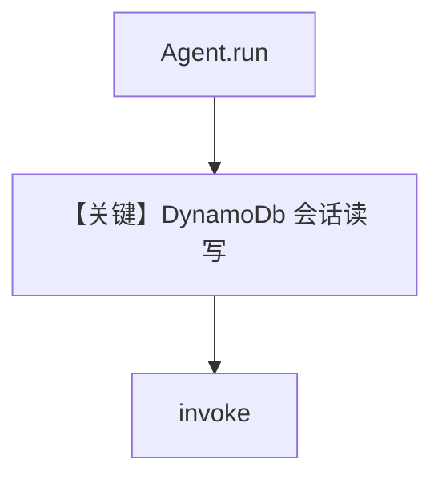

# dynamo_for_agent.py — 实现原理分析

> 源文件：`cookbook/06_storage/dynamodb/dynamo_for_agent.py`

## 概述

本示例展示 Agno 的 **DynamoDb 作为 Agent 存储**：`DynamoDb()` 依赖 AWS 环境变量；Agent **未显式设置 model**（需环境默认或自行补充），`add_history_to_context=True`。

**核心配置一览：**

| 配置项 | 值 | 说明 |
|--------|------|------|
| `db` | `DynamoDb()` | AWS 凭证见文件头注释 |
| `name` | `"DynamoDB Agent"` | 名称 |
| `description` | `"An agent that uses DynamoDB as a database"` | 进入 `# 3.3.1` |
| `add_history_to_context` | `True` | 历史 |
| `model` | 未设置 | 未设置 |
| `tools` | 未设置 | 未设置 |

## 架构分层

与 Postgres/Sqlite 相同抽象：`BaseDb` 持久化 session/run；区别在 `agno/db` Dynamo 适配器实现。

## System Prompt 组装

### 还原后的完整 System 文本（静态段）

```text
An agent that uses DynamoDB as a database
```

（`description` 作为 `# 3.3.1`；若仅有 description 而无 instructions，正文以 description 开头，见 `_messages.py` L233–236。）

## 完整 API 请求

需配置有效 `model` 后才有 `chat.completions.create`；否则可能在运行早期失败。

## Mermaid 流程图



## 关键源码文件索引

| 文件 | 作用 |
|------|------|
| `agno/db/dynamo` | `DynamoDb` |
| `agno/agent/_messages.py` | `get_system_message` L106+ |
