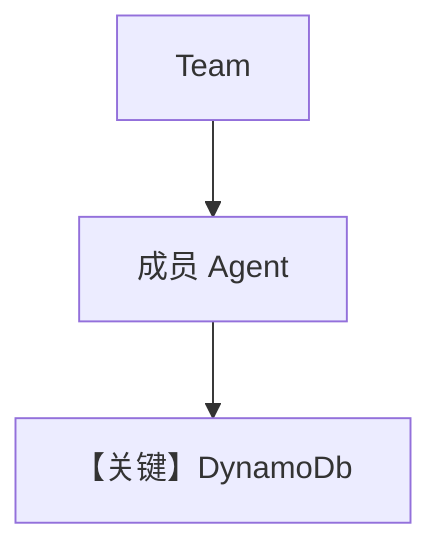

# dynamo_for_team.py — 实现原理分析

<!-- cookbook-py-source:start -->
## 完整源码

```python
"""Use DynamoDb as the database for a team.

Set the following environment variables to connect to your DynamoDb instance:
- AWS_ACCESS_KEY_ID
- AWS_SECRET_ACCESS_KEY
- AWS_REGION

Or pass those parameters when initializing the DynamoDb instance.

Run `uv pip install openai ddgs newspaper4k lxml_html_clean agno` to install the dependencies
"""

from typing import List

from agno.agent import Agent
from agno.db.dynamo import DynamoDb
from agno.models.openai import OpenAIChat
from agno.team import Team
from agno.tools.hackernews import HackerNewsTools
from agno.tools.websearch import WebSearchTools
from pydantic import BaseModel

# ---------------------------------------------------------------------------
# Setup
# ---------------------------------------------------------------------------
db = DynamoDb()


# ---------------------------------------------------------------------------
# Create Team
# ---------------------------------------------------------------------------
class Article(BaseModel):
    title: str
    summary: str
    reference_links: List[str]


hn_researcher = Agent(
    name="HackerNews Researcher",
    model=OpenAIChat("gpt-4o"),
    role="Gets top stories from hackernews.",
    tools=[HackerNewsTools()],
)

web_searcher = Agent(
    name="Web Searcher",
    model=OpenAIChat("gpt-4o"),
    role="Searches the web for information on a topic",
    tools=[WebSearchTools()],
    add_datetime_to_context=True,
)

hn_team = Team(
    name="HackerNews Team",
    model=OpenAIChat("gpt-4o"),
    members=[hn_researcher, web_searcher],
    db=db,
    instructions=[
        "First, search hackernews for what the user is asking about.",
        "Then, ask the web searcher to search for each story to get more information.",
        "Finally, provide a thoughtful and engaging summary.",
    ],
    output_schema=Article,
    markdown=True,
    show_members_responses=True,
)

# ---------------------------------------------------------------------------
# Run Team
# ---------------------------------------------------------------------------
if __name__ == "__main__":
    hn_team.print_response("Write an article about the top 2 stories on hackernews")
```

<!-- cookbook-py-source:end -->

> 源文件：`cookbook/06_storage/dynamodb/dynamo_for_team.py`

## 概述

本示例展示 Agno 的 **DynamoDb + Team + 结构化输出**：与 `postgres_for_team` / `dynamo_for_team` 同构，`Article` 为 `output_schema`；成员含 HN 与 Web 工具，`Team` 统一下发指令与 `markdown=True`。

**核心配置一览：**

| 配置项 | 值 | 说明 |
|--------|------|------|
| `db` | `DynamoDb()` | 团队会话 |
| `hn_researcher` / `web_searcher` | `OpenAIChat("gpt-4o")`, 工具与 role | 成员 |
| `hn_team` | `instructions` 列表, `output_schema=Article`, `show_members_responses=True` | Team |
| `add_datetime_to_context` | web_searcher 上为 `True` | 时间进 system |

## 核心组件解析

### output_schema

Team 层 schema 触发 JSON/结构化约束（见 `team/_messages.py` 对 schema 的分支，约 L314+）。

## System Prompt 组装

Team `instructions` 三条见源码 L58–62；逐字：

```text
First, search hackernews for what the user is asking about.
Then, ask the web searcher to search for each story to get more information.
Finally, provide a thoughtful and engaging summary.
```

成员 `hn_researcher` 使用 `<your_role>`：`Gets top stories from hackernews.`

## 完整 API 请求

Team 主模型 `gpt-4o` → `chat.completions.create`；成员调用同理。

## Mermaid 流程图



## 关键源码文件索引

| 文件 | 作用 |
|------|------|
| `agno/team/_messages.py` | `get_system_message` L328+ |
| `agno/db/dynamo` | `DynamoDb` |
