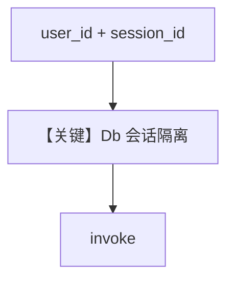

# multi_user_multi_session.py — 实现原理分析

<!-- cookbook-py-source:start -->
## 完整源码

```python
"""
Multi-User Multi-Session
========================

Demonstrates handling multiple users and sessions with SQLite-backed agent storage.
"""

from agno.agent import Agent
from agno.db.sqlite import SqliteDb
from agno.models.openai import OpenAIChat

# ---------------------------------------------------------------------------
# Setup
# ---------------------------------------------------------------------------
db = SqliteDb(db_file="tmp/data.db")
user_1_id = "user_101"
user_2_id = "user_102"
user_1_session_id = "session_101"
user_2_session_id = "session_102"

# ---------------------------------------------------------------------------
# Create Agent
# ---------------------------------------------------------------------------
agent = Agent(
    model=OpenAIChat(id="gpt-5.2"),
    db=db,
    update_memory_on_run=True,
    add_history_to_context=True,
    num_history_runs=3,
)

# ---------------------------------------------------------------------------
# Run Agent
# ---------------------------------------------------------------------------
if __name__ == "__main__":
    # Start the session with user 1
    agent.print_response(
        "Tell me a 5 second short story about a robot.",
        user_id=user_1_id,
        session_id=user_1_session_id,
    )
    # Continue the session with user 1
    agent.print_response(
        "Now tell me a joke.", user_id=user_1_id, session_id=user_1_session_id
    )

    # Start the session with user 2
    agent.print_response(
        "Tell me about quantum physics.",
        user_id=user_2_id,
        session_id=user_2_session_id,
    )
    # Continue the session with user 2
    agent.print_response(
        "What is the speed of light?", user_id=user_2_id, session_id=user_2_session_id
    )

    # Ask the agent to give a summary of the conversation, this will use the history from the previous messages
    agent.print_response(
        "Give me a summary of our conversation.",
        user_id=user_1_id,
        session_id=user_1_session_id,
    )
```

<!-- cookbook-py-source:end -->

> 源文件：`cookbook/06_storage/examples/multi_user_multi_session.py`

## 概述

本示例展示 **同一 Agent 实例上切换 `user_id` / `session_id`**：`SqliteDb` 持久化；`update_memory_on_run=True` 与 `num_history_runs=3` 控制记忆与历史窗口；演示多用户会话隔离与回到 user1 摘要。

**核心配置一览：**

| 配置项 | 值 | 说明 |
|--------|------|------|
| `model` | `OpenAIChat(gpt-5.2)` | Chat Completions |
| `db` | `SqliteDb(tmp/data.db)` | 本地 |
| `update_memory_on_run` | `True` | 运行更新记忆 |
| `add_history_to_context` | `True` | 历史进上下文 |
| `num_history_runs` | `3` | 历史条数 |

## 架构分层

`print_response(..., user_id=..., session_id=...)` 将会话路由到不同存储键；`get_run_messages` 合并对应历史（`_messages.py` 约 L1618+）。

## 运行机制与因果链

1. **路径**：user1 两轮 → user2 两轮 → 再 user1 摘要请求。  
2. **副作用**：Sqlite 多行 session；记忆表若启用则更新。  
3. **定位**：**多租户会话键** 用法。

## System Prompt 组装

无 `instructions`；默认 system 较短。摘要请求依赖 **历史注入** 与记忆（若存在）。

## 完整 API 请求

`OpenAIChat` → `chat.completions.create`（`chat.py` L412+）。

## Mermaid 流程图



## 关键源码文件索引

| 文件 | 作用 |
|------|------|
| `agno/agent/agent.py` | `print_response` 参数 |
| `agno/db/sqlite.py` | `SqliteDb` |
