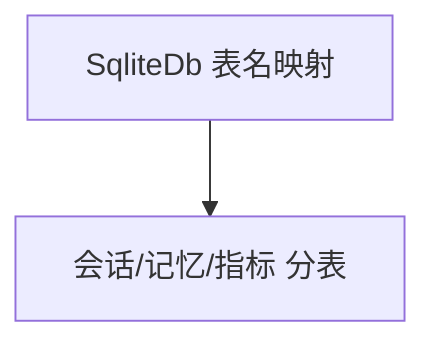

# selecting_tables.py — 实现原理分析

<!-- cookbook-py-source:start -->
## 完整源码

```python
"""Use SQLite as the database for an Agent, selecting custom names for the tables.

Run `uv pip install ddgs sqlalchemy openai` to install dependencies.
"""

from agno.agent import Agent
from agno.db.sqlite import SqliteDb

# ---------------------------------------------------------------------------
# Setup
# ---------------------------------------------------------------------------
db = SqliteDb(
    db_file="tmp/data.db",
    # Selecting which tables to use
    session_table="agent_sessions",
    memory_table="agent_memories",
    metrics_table="agent_metrics",
)

# ---------------------------------------------------------------------------
# Create Agent
# ---------------------------------------------------------------------------
agent = Agent(
    db=db,
    update_memory_on_run=True,
    add_history_to_context=True,
    add_datetime_to_context=True,
)

# ---------------------------------------------------------------------------
# Run Agent
# ---------------------------------------------------------------------------
if __name__ == "__main__":
    # The Agent sessions and runs will now be stored in SQLite
    agent.print_response("How many people live in Canada?")
    agent.print_response("And in Mexico?")
    agent.print_response("List my messages one by one")
```

<!-- cookbook-py-source:end -->

> 源文件：`cookbook/06_storage/examples/selecting_tables.py`

## 概述

本示例展示 **`SqliteDb` 自定义表名**：`session_table`、`memory_table`、`metrics_table` 指向不同物理表，便于在同一 SQLite 文件内 **逻辑分表** 或与多应用共库。

**核心配置一览：**

| 配置项 | 值 | 说明 |
|--------|------|------|
| `db` | `SqliteDb(db_file, session_table=..., memory_table=..., metrics_table=...)` | 表名映射 |
| `update_memory_on_run` | `True` | 写记忆表 |
| `add_history_to_context` | `True` | 历史 |
| `add_datetime_to_context` | `True` | 时间 |

## 核心组件解析

表名由 `PostgresDb`/`SqliteDb` 等适配器在 DDL 与查询中使用；**不改变** `get_system_message` 逻辑。

## 完整 API 请求

未显式 `model` 时需补全；否则无 LLM 调用。

## Mermaid 流程图



## 关键源码文件索引

| 文件 | 作用 |
|------|------|
| `agno/db/sqlite.py` | 构造函数表参数 |
