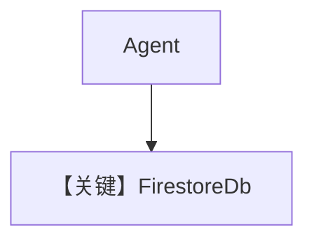

# firestore_for_agent.py — 实现原理分析

<!-- cookbook-py-source:start -->
## 完整源码

```python
"""
This recipe shows how to store agent sessions in a Firestore database.

Steps:
1. Ensure your gcloud project is enabled with Firestore. Reference https://cloud.google.com/firestore/docs/create-database-server-client-library ?
2. Run: `uv pip install openai google-cloud-firestore agno` to install dependencies
3. Make sure your gcloud project is set up and you have the necessary permissions to access Firestore
4. Run: `python cookbook/storage/firestore_storage.py` to run the agent
"""

from agno.agent import Agent
from agno.db.firestore import FirestoreDb
from agno.tools.websearch import WebSearchTools

PROJECT_ID = "agno-os-test"  # Use your project ID here

# ---------------------------------------------------------------------------
# Setup
# ---------------------------------------------------------------------------
# The only required argument is the collection name.
# Firestore will connect automatically using your google cloud credentials.
# The class uses the (default) database by default to allow free tier access to firestore.
# You can specify a project_id if you'd like to connect to firestore in a different GCP project
db = FirestoreDb(project_id=PROJECT_ID)

# ---------------------------------------------------------------------------
# Create Agent
# ---------------------------------------------------------------------------
agent = Agent(
    db=db,
    tools=[WebSearchTools()],
    add_history_to_context=True,
)

# ---------------------------------------------------------------------------
# Run Agent
# ---------------------------------------------------------------------------
if __name__ == "__main__":
    agent.print_response("How many people live in Canada?")
    agent.print_response("What is their national anthem called?")
```

<!-- cookbook-py-source:end -->

> 源文件：`cookbook/06_storage/firestore/firestore_for_agent.py`

## 概述

本示例展示 **`FirestoreDb` + WebSearch**：`project_id` 指定 GCP 项目，凭据走 ADC；`Agent` 无显式 `model`，`add_history_to_context=True`。

**核心配置一览：**

| 配置项 | 值 | 说明 |
|--------|------|------|
| `db` | `FirestoreDb(project_id=PROJECT_ID)` | Firestore |
| `tools` | `[WebSearchTools()]` | 工具 |
| `add_history_to_context` | `True` | 历史 |
| `model` | 未设置 | 须补全 |

## 架构分层

与 Sqlite/Postgres 相同抽象；读写 Firestore 集合由 `agno/db/firestore` 实现。

## 完整 API 请求

配置模型后：`chat.completions.create`（若用 `OpenAIChat`）。

## Mermaid 流程图



## 关键源码文件索引

| 文件 | 作用 |
|------|------|
| `agno/db/firestore` | `FirestoreDb` |
