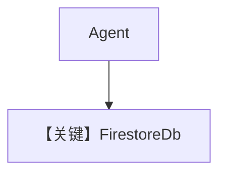

# firestore_for_agent.py — 实现原理分析

> 源文件：`cookbook/06_storage/firestore/firestore_for_agent.py`

## 概述

本示例展示 **`FirestoreDb` + WebSearch**：`project_id` 指定 GCP 项目，凭据走 ADC；`Agent` 无显式 `model`，`add_history_to_context=True`。

**核心配置一览：**

| 配置项 | 值 | 说明 |
|--------|------|------|
| `db` | `FirestoreDb(project_id=PROJECT_ID)` | Firestore |
| `tools` | `[WebSearchTools()]` | 工具 |
| `add_history_to_context` | `True` | 历史 |
| `model` | 未设置 | 须补全 |

## 架构分层

与 Sqlite/Postgres 相同抽象；读写 Firestore 集合由 `agno/db/firestore` 实现。

## 完整 API 请求

配置模型后：`chat.completions.create`（若用 `OpenAIChat`）。

## Mermaid 流程图

## 关键源码文件索引

| 文件 | 作用 |
|------|------|
| `agno/db/firestore` | `FirestoreDb` |
