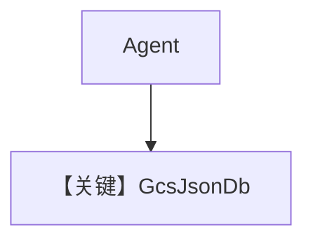

# gcs_json_for_agent.py — 实现原理分析

<!-- cookbook-py-source:start -->
## 完整源码

```python
"""
GCS JSON Storage for Agent
==========================

Demonstrates using GcsJsonDb as the session storage backend for an Agno agent.
"""

import uuid

import google.auth
from agno.agent import Agent
from agno.db.base import SessionType
from agno.db.gcs_json import GcsJsonDb
from agno.tools.websearch import WebSearchTools

DEBUG_MODE = False

# ---------------------------------------------------------------------------
# Setup
# ---------------------------------------------------------------------------
# Obtain the default credentials and project id from your gcloud CLI session.
credentials, project_id = google.auth.default()

# Generate a unique bucket name using a base name and a UUID4 suffix.
base_bucket_name = "example-gcs-bucket"
unique_bucket_name = f"{base_bucket_name}-{uuid.uuid4().hex[:12]}"

# Initialize GCSJsonDb with explicit credentials, unique bucket name, and project.
db = GcsJsonDb(
    bucket_name=unique_bucket_name,
    prefix="agent/",
    project=project_id,
    credentials=credentials,
)

# ---------------------------------------------------------------------------
# Create Agents
# ---------------------------------------------------------------------------
# Initialize Agno agent1 with the new storage backend and a web search tool.
agent1 = Agent(
    db=db,
    tools=[WebSearchTools()],
    add_history_to_context=True,
    debug_mode=DEBUG_MODE,
)

# ---------------------------------------------------------------------------
# Run Agents
# ---------------------------------------------------------------------------
if __name__ == "__main__":
    print(f"Using bucket: {unique_bucket_name}")

    # Execute sample queries.
    agent1.print_response("How many people live in Canada?")
    agent1.print_response("What is their national anthem called?")

    # Create a new agent and continue the existing conversation.
    agent2 = Agent(
        db=db,
        session_id=agent1.session_id,
        tools=[WebSearchTools()],
        add_history_to_context=True,
        debug_mode=DEBUG_MODE,
    )
    agent2.print_response("What's the name of the country we discussed?")
    agent2.print_response("What is that country's national sport?")

    # After running agent1, print bucket content: session IDs and memory.
    if DEBUG_MODE:
        print(f"\nBucket {db.bucket_name} contents:")
        sessions = db.get_sessions(session_type=SessionType.AGENT)
        for session in sessions:
            print(f"Session {session.session_id}:\n\t{session.memory}")  # type: ignore
            print("-" * 40)
```

<!-- cookbook-py-source:end -->

> 源文件：`cookbook/06_storage/gcs/gcs_json_for_agent.py`

## 概述

本示例展示 **`GcsJsonDb`**：用 **唯一 bucket 名**（前缀+UUID）在 GCS 存会话 JSON；`google.auth.default()` 取凭证与项目；`agent1` 使用 `WebSearchTools`，`debug_mode` 由常量控制。

**核心配置一览：**

| 配置项 | 值 | 说明 |
|--------|------|------|
| `db` | `GcsJsonDb(bucket_name=..., prefix=agent/, project=..., credentials=...)` | GCS |
| `tools` | `[WebSearchTools()]` | 工具 |
| `add_history_to_context` | `True` | 历史 |
| `debug_mode` | `DEBUG_MODE` 常量 | 调试 |

## 架构分层

会话序列化为对象存 GCS；语义与文件系统 JSON 后端类似，**延迟与一致性**受 GCS 影响。

## 完整 API 请求

配置 `OpenAIChat` 等后走对应 `invoke`。

## Mermaid 流程图



## 关键源码文件索引

| 文件 | 作用 |
|------|------|
| `agno/db/gcs_json.py` | `GcsJsonDb` |
