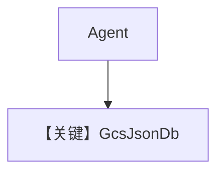

# gcs_json_for_agent.py — 实现原理分析

> 源文件：`cookbook/06_storage/gcs/gcs_json_for_agent.py`

## 概述

本示例展示 **`GcsJsonDb`**：用 **唯一 bucket 名**（前缀+UUID）在 GCS 存会话 JSON；`google.auth.default()` 取凭证与项目；`agent1` 使用 `WebSearchTools`，`debug_mode` 由常量控制。

**核心配置一览：**

| 配置项 | 值 | 说明 |
|--------|------|------|
| `db` | `GcsJsonDb(bucket_name=..., prefix=agent/, project=..., credentials=...)` | GCS |
| `tools` | `[WebSearchTools()]` | 工具 |
| `add_history_to_context` | `True` | 历史 |
| `debug_mode` | `DEBUG_MODE` 常量 | 调试 |

## 架构分层

会话序列化为对象存 GCS；语义与文件系统 JSON 后端类似，**延迟与一致性**受 GCS 影响。

## 完整 API 请求

配置 `OpenAIChat` 等后走对应 `invoke`。

## Mermaid 流程图

## 关键源码文件索引

| 文件 | 作用 |
|------|------|
| `agno/db/gcs_json.py` | `GcsJsonDb` |
