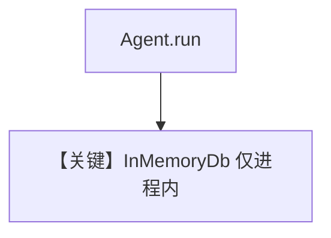

# in_memory_storage_for_agent.py — 实现原理分析

<!-- cookbook-py-source:start -->
## 完整源码

```python
"""Run `uv pip install ddgs openai` to install dependencies."""

from agno.agent import Agent
from agno.db.in_memory import InMemoryDb

# ---------------------------------------------------------------------------
# Setup
# ---------------------------------------------------------------------------
db = InMemoryDb()

# ---------------------------------------------------------------------------
# Create Agent
# ---------------------------------------------------------------------------
agent = Agent(db=db)

# ---------------------------------------------------------------------------
# Run Agent
# ---------------------------------------------------------------------------
if __name__ == "__main__":
    # The Agent sessions will now be stored in the in-memory database
    agent.print_response("Give me an easy and healthy dinner recipe")
```

<!-- cookbook-py-source:end -->

> 源文件：`cookbook/06_storage/in_memory/in_memory_storage_for_agent.py`

## 概述

本示例展示 **`InMemoryDb`**：无磁盘路径，进程内保存会话；适合 **单元测试与极简 demo**，重启即失。

**核心配置一览：**

| 配置项 | 值 | 说明 |
|--------|------|------|
| `db` | `InMemoryDb()` | 内存 |
| `agent` | 仅 `db=db` | 无 model/tools 显式设置 |

## 架构分层

与持久化 Db 实现相同接口；数据仅存当前进程堆。

## System Prompt 组装

无 `instructions`；需显式 `model` 才能调用云端。

## 完整 API 请求

补全 `model` 后调用；否则运行失败。

## Mermaid 流程图



## 关键源码文件索引

| 文件 | 作用 |
|------|------|
| `agno/db/in_memory.py` | `InMemoryDb` |
