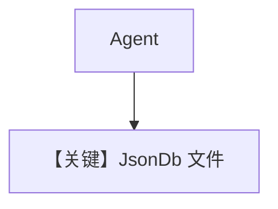

# json_for_agent.py — 实现原理分析

> 源文件：`cookbook/06_storage/json_db/json_for_agent.py`

## 概述

本示例展示 **`JsonDb` 文件型存储**：`db_path=tmp/json_dir` 将会话以 JSON 落盘；`OpenAIChat(gpt-5.2)`、`session_id`、`num_history_runs=3` 与 `WebSearchTools` 组合，适合轻量演示。

**核心配置一览：**

| 配置项 | 值 | 说明 |
|--------|------|------|
| `db` | `JsonDb(db_path="tmp/json_db")` | JSON 目录 |
| `model` | `OpenAIChat(id="gpt-5.2")` | Chat Completions |
| `session_id` | `"session_storage"` | 会话键 |
| `tools` | `[WebSearchTools()]` | 工具 |
| `add_history_to_context` | `True` | 历史 |
| `num_history_runs` | `3` | 条数 |

## 架构分层

与 Sqlite 相同 Agent 抽象；底层为文件读写，并发与锁由实现保证。

## 完整 API 请求

`OpenAIChat.invoke` → `chat.completions.create`（`chat.py` L412+）。

## Mermaid 流程图

## 关键源码文件索引

| 文件 | 作用 |
|------|------|
| `agno/db/json.py` | `JsonDb` |
