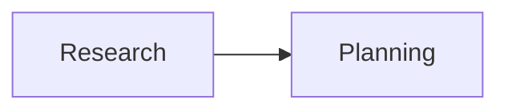

# async_mysql_for_workflow.py — 实现原理分析

<!-- cookbook-py-source:start -->
## 完整源码

```python
"""Use Async MySQL as the database for a workflow.
Run `uv pip install openai duckduckgo-search sqlalchemy asyncmy agno` to install dependencies.
"""

import asyncio
import uuid
from typing import List

from agno.agent import Agent
from agno.db.base import SessionType
from agno.db.mysql import AsyncMySQLDb
from agno.tools.websearch import WebSearchTools
from agno.workflow.types import WorkflowExecutionInput
from agno.workflow.workflow import Workflow
from pydantic import BaseModel

# ---------------------------------------------------------------------------
# Setup
# ---------------------------------------------------------------------------
db_url = "mysql+asyncmy://ai:ai@localhost:3306/ai"
db = AsyncMySQLDb(db_url=db_url)


# ---------------------------------------------------------------------------
# Create Workflow
# ---------------------------------------------------------------------------
class ResearchTopic(BaseModel):
    topic: str
    key_points: List[str]
    summary: str


# Create researcher agent
researcher = Agent(
    name="Researcher",
    tools=[WebSearchTools()],
    instructions="Research the given topic thoroughly and provide key insights",
    output_schema=ResearchTopic,
)

# Create writer agent
writer = Agent(
    name="Writer",
    instructions="Write a well-structured blog post based on the research provided",
)


# Define the workflow
async def blog_workflow(workflow: Workflow, execution_input: WorkflowExecutionInput):
    """
    A workflow that researches a topic and writes a blog post about it.
    """
    topic = execution_input.input

    # Step 1: Research the topic
    research_result = await researcher.arun(f"Research this topic: {topic}")

    # Step 2: Write the blog post
    if research_result and research_result.content:
        blog_result = await writer.arun(
            f"Write a blog post about {topic}. Use this research: {research_result.content.model_dump_json()}"
        )
        return blog_result.content

    return "Failed to complete workflow"


workflow = Workflow(
    name="Blog Generator",
    steps=blog_workflow,
    db=db,
)


# ---------------------------------------------------------------------------
# Run Workflow
# ---------------------------------------------------------------------------
async def main():
    """Run the workflow with a sample topic"""
    session_id = str(uuid.uuid4())

    await workflow.aprint_response(
        input="The future of artificial intelligence",
        session_id=session_id,
        markdown=True,
    )
    session_data = await db.get_session(
        session_id=session_id, session_type=SessionType.WORKFLOW
    )
    print("\n=== SESSION DATA ===")
    print(session_data.to_dict())


if __name__ == "__main__":
    asyncio.run(main())
```

<!-- cookbook-py-source:end -->

> 源文件：`cookbook/06_storage/mysql/async_mysql/async_mysql_for_workflow.py`

## 概述

本示例展示 **AsyncMySQLDb** 作为 **Workflow** 的 `db`：`Workflow(..., db=...)` 持久化工作流会话；结构为 **Team 研究步 + Agent 规划步**（与 `postgres_for_workflow.py` 一致）。

**核心配置一览：**

| 配置项 | 值 | 说明 |
|--------|------|------|
| `research_team` | `Team(members=[...], instructions=...)` | 第一步 |
| `content_planner` | `OpenAIChat`, `instructions` 列表 | 第二步 |
| `Workflow` | `db=AsyncMySQLDb(...)` | 会话表见源文件 |

## 架构分层

`Workflow.print_response` → 各 Step → Agent/Team run → DB。

## System Prompt 组装

分步还原见各 Agent/Team 源码；无单一 OS 级 system。

## 完整 API 请求

各步 `OpenAIChat.invoke` / Team 主循环。

## Mermaid 流程图



## 关键源码文件索引

| 文件 | 作用 |
|------|------|
| `agno/workflow/workflow.py` | `Workflow` |
| `agno/db/*` | `db` 参数 |
