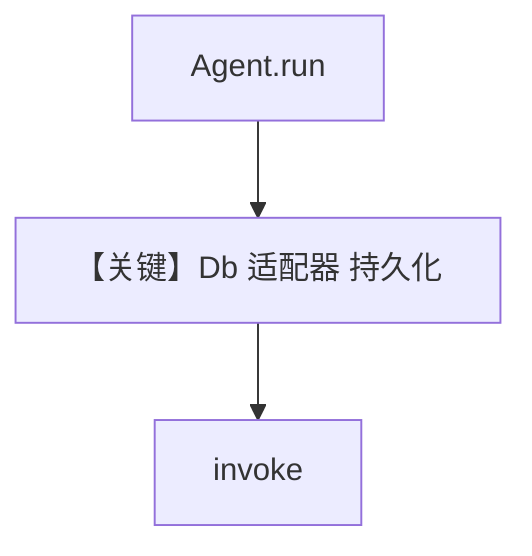

# mysql_for_agent.py — 实现原理分析

> 源文件：`cookbook/06_storage/mysql/mysql_for_agent.py`

## 概述

本示例展示 Agno 使用 **MySQLDb** 作为 **Agent** 会话/运行存储：`Agent(db=db, ...)` 将多轮对话与元数据写入该后端；与具体模型无关，重点在 **存储适配器** 与 `add_history_to_context` 行为。

**核心配置一览：**

| 配置项 | 值 | 说明 |
|--------|------|------|
| `db` | `MySQLDb(db_url=mysql+pymysql://...)` | MySQL |
| `add_history_to_context` | `True` | 历史 |
| `tools` | 未设置 | 未设置 |
| `model` | 未设置 | 未设置 |

## 架构分层

```
Agent.run / print_response
    → get_run_messages（若 add_history_to_context 则合并历史，_messages.py 约 L1618+）
    → Model.invoke
    → db 持久化 session / run（具体表结构依适配器）
```

## 核心组件解析

### 存储后端

`MySQLDb` 实现 `BaseDb` 契约；会话键由 `session_id` / `user_id`（若传入）决定。

### 运行机制与因果链

1. **数据路径**：用户输入 → LLM → 响应落库 → 下次 run 读历史（若开启）。
2. **副作用**：仅会话存储；无知识库写入。
3. **与相邻示例差异**：同目录 `*_for_team` / `*_for_workflow` 展示多实体存储形态。


## System Prompt 组装

本类示例 **重点不在提示词**；若未设置 `instructions`，默认 system 由 `get_system_message()`（`agno/agent/_messages.py` L106+）按模型与默认标志拼装。请用断点打印最终 `Message.content` 验证。

### 还原后的完整 System 文本

若源码未提供 `instructions`/`description`，无法静态还原长正文；禁止用括号占位糊弄——请以运行时打印为准。

## 完整 API 请求

配置 `OpenAIChat` 等模型后：`client.chat.completions.create(...)`（`agno/models/openai/chat.py` L412+）；历史来自 `get_run_messages`。

## Mermaid 流程图



## 关键源码文件索引

| 文件 | 作用 |
|------|------|
| `agno/db/*` | 具体 `Db` 类 |
| `agno/agent/_messages.py` | `get_run_messages` |
| `agno/models/openai/chat.py` | `invoke` L385+ |
