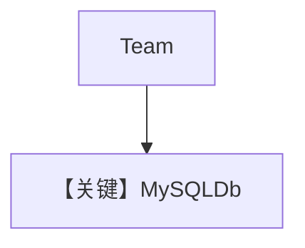

# mysql_for_team.py — 实现原理分析

> 源文件：`cookbook/06_storage/mysql/mysql_for_team.py`

## 概述

本示例展示 **MySQLDb** 作为 **Team** 会话存储，并与 `postgres_for_team` / `dynamo_for_team` 同构：**两成员 Agent + Team 指令 + `output_schema=Article`**。

**核心配置一览：**

| 配置项 | 值 | 说明 |
|--------|------|------|
| `db` | `MySQLDb(...)` | Team 级存储 |
| `hn_researcher` / `web_searcher` | `OpenAIChat("gpt-4o")`, 工具, `role` | 成员 |
| `Team` | `instructions` 列表, `output_schema=Article`, `markdown=True`, `show_members_responses=True` | 协调 |


## 架构分层

`Team.print_response` → 成员子调用 → `PostgresDb` 同类抽象写入；Team system 见 `agno/team/_messages.py` L328+。

## System Prompt 组装

Team 指令三条（若与 postgres 示例相同）：

```text
First, search hackernews for what the user is asking about.
Then, ask the web searcher to search for each story to get more information.
Finally, provide a thoughtful and engaging summary.
```

## 完整 API 请求

`OpenAIChat` → `chat.completions.create`（`chat.py` L412+）。

## Mermaid 流程图



## 关键源码文件索引

| 文件 | 作用 |
|------|------|
| `agno/team/_messages.py` | `get_system_message` L328+ |
| `agno/db/*` | 存储适配器 |
