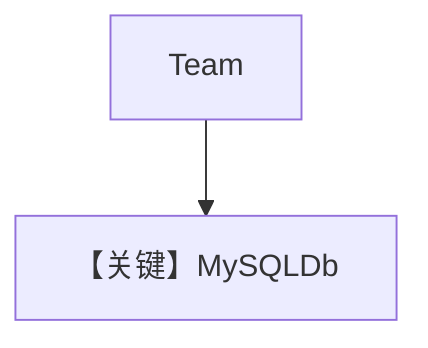

# mysql_for_team.py — 实现原理分析

<!-- cookbook-py-source:start -->
## 完整源码

```python
"""Use MySQL as the database for a team.

Run `uv pip install openai ddgs newspaper4k lxml_html_clean agno` to install the dependencies
"""

from typing import List

from agno.agent import Agent
from agno.db.mysql import MySQLDb
from agno.models.openai import OpenAIChat
from agno.team import Team
from agno.tools.hackernews import HackerNewsTools
from agno.tools.websearch import WebSearchTools
from pydantic import BaseModel

# ---------------------------------------------------------------------------
# Setup
# ---------------------------------------------------------------------------
db_url = "mysql+pymysql://ai:ai@localhost:3306/ai"
db = MySQLDb(db_url=db_url)


# ---------------------------------------------------------------------------
# Create Team
# ---------------------------------------------------------------------------
class Article(BaseModel):
    title: str
    summary: str
    reference_links: List[str]


hn_researcher = Agent(
    name="HackerNews Researcher",
    model=OpenAIChat("gpt-4o"),
    role="Gets top stories from hackernews.",
    tools=[HackerNewsTools()],
)

web_searcher = Agent(
    name="Web Searcher",
    model=OpenAIChat("gpt-4o"),
    role="Searches the web for information on a topic",
    tools=[WebSearchTools()],
    add_datetime_to_context=True,
)


hn_team = Team(
    name="HackerNews Team",
    model=OpenAIChat("gpt-4o"),
    members=[hn_researcher, web_searcher],
    db=db,
    instructions=[
        "First, search hackernews for what the user is asking about.",
        "Then, ask the web searcher to search for each story to get more information.",
        "Finally, provide a thoughtful and engaging summary.",
    ],
    output_schema=Article,
    markdown=True,
    show_members_responses=True,
    add_member_tools_to_context=False,
)

# ---------------------------------------------------------------------------
# Run Team
# ---------------------------------------------------------------------------
if __name__ == "__main__":
    hn_team.print_response("Write an article about the top 2 stories on hackernews")
```

<!-- cookbook-py-source:end -->

> 源文件：`cookbook/06_storage/mysql/mysql_for_team.py`

## 概述

本示例展示 **MySQLDb** 作为 **Team** 会话存储，并与 `postgres_for_team` / `dynamo_for_team` 同构：**两成员 Agent + Team 指令 + `output_schema=Article`**。

**核心配置一览：**

| 配置项 | 值 | 说明 |
|--------|------|------|
| `db` | `MySQLDb(...)` | Team 级存储 |
| `hn_researcher` / `web_searcher` | `OpenAIChat("gpt-4o")`, 工具, `role` | 成员 |
| `Team` | `instructions` 列表, `output_schema=Article`, `markdown=True`, `show_members_responses=True` | 协调 |


## 架构分层

`Team.print_response` → 成员子调用 → `PostgresDb` 同类抽象写入；Team system 见 `agno/team/_messages.py` L328+。

## System Prompt 组装

Team 指令三条（若与 postgres 示例相同）：

```text
First, search hackernews for what the user is asking about.
Then, ask the web searcher to search for each story to get more information.
Finally, provide a thoughtful and engaging summary.
```

## 完整 API 请求

`OpenAIChat` → `chat.completions.create`（`chat.py` L412+）。

## Mermaid 流程图



## 关键源码文件索引

| 文件 | 作用 |
|------|------|
| `agno/team/_messages.py` | `get_system_message` L328+ |
| `agno/db/*` | 存储适配器 |
